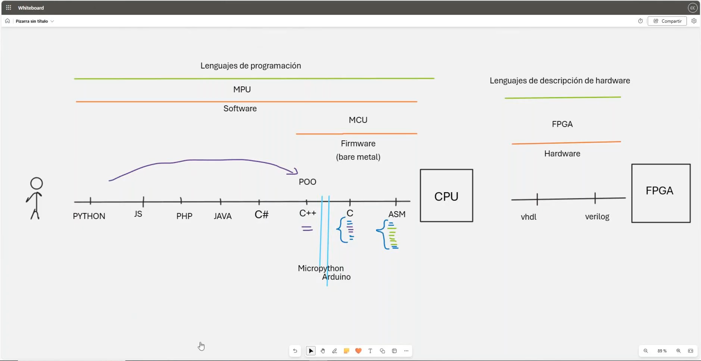

# 🛠️ Clase 0: Tópicos previos

En esta clase introductoria, exploramos conceptos clave relacionados con **microcontroladores (MCU)** y **microprocesadores (MPU)**, además de los diferentes tipos de lenguajes utilizados en sistemas de hardware y software. Esta información establece una base sólida para comprender mejor los sistemas embebidos y de propósito general.

## 📖 Contenido
1. **🔍 Introducción a MCU y MPU**
    - ✨ Diferencias entre **Microcontroladores (MCU)** y **Microprocesadores (MPU)**.
    - 🔗 Aplicaciones en sistemas **embebidos** y **de propósito general**.
    - 🏢 **Fabricantes destacados** y sus productos relacionados.

2. **💻 Lenguajes de Programación y Hardware**
    - 📊 **Clasificación de los lenguajes** según su propósito:
        - 🖥️ **Lenguajes para programación de Software:** C, C++, Java, Python, etc.
        - ⚙️ **Lenguajes para programación de Firmware:** C, C++, ASM.
        - 📜 **Lenguajes de descripción de Hardware:** Verilog, VHDL.

## 🖼️ Capturas de Pantalla

A continuación, se muestran las capturas utilizadas en la clase:

### 1️⃣ MCU y MPU

### 2️⃣ Lenguajes de Programación y Hardware

---

## 👨‍💻 Sobre el Autor
- **👤 Nombre:** Edwin Yoner
- **📧 Contacto:** [✉️ edwinyoner@gmail.com](mailto:edwinyoner@gmail.com)
- **🔗 LinkedIn:** [🌐 linkedin.com/in/edwinyoner](https://www.linkedin.com/in/edwinyoner)