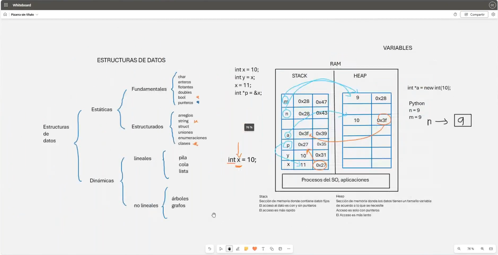
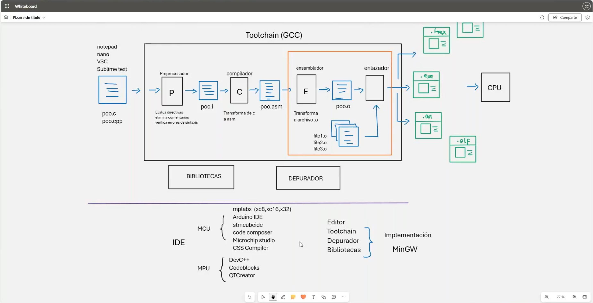

# 🛠️ Clase 1: Introducción y fundamentos

En esta clase, exploramos dos áreas fundamentales de la programación: **estructuras de datos** y el **toolchain de desarrollo** (GCC). Aprendemos los conceptos básicos de cómo la memoria se organiza en **stack** y **heap**, y cómo las herramientas de desarrollo se combinan para convertir el código fuente en ejecutables.

---

## 📖 Contenido

### 1️⃣ **🔍 Estructuras de Datos**
- **📊 Clasificación de las estructuras de datos:**
    - **Estáticas:**
        - Fundamentos:
            - Enteros, flotantes, caracteres, booleanos, punteros.
        - Estructurados:
            - Arreglos, cadenas (strings), estructuras (struct), uniones, enumeraciones, clases.
    - **Dinámicas:**
        - **Lineales:** Pilas, colas, listas.
        - **No lineales:** Árboles, grafos.

- **📂 Memoria y Variables**
    - **Stack:**
        - Sección de memoria que contiene datos locales.
        - Acceso rápido, pero limitado a variables de duración local.
    - **Heap:**
        - Espacio de memoria dinámico.
        - Usado con punteros para asignaciones manuales (`new`, `malloc`).

### 2️⃣ **💻 Toolchain y Herramientas de Desarrollo (GCC)**
- **📋 Componentes del Toolchain:**
    - **Preprocesador:**
        - Evalúa directivas, elimina comentarios, verifica errores de sintaxis.
    - **Compilador:**
        - Convierte el código fuente a lenguaje ensamblador.
    - **Ensamblador:**
        - Transforma el código ensamblador en binarios (`.o`).
    - **Enlazador:**
        - Vincula los archivos binarios con bibliotecas externas para producir ejecutables (`.exe`, `.out`, `.elf`).

- **🛠️ Herramientas de Desarrollo:**
    - **IDE y Compiladores:**
      - **MCU**
          - MPLAB X, Arduino IDE, STM32CubeIDE, Microchip Studio, CSS Compiler.
      - **MPU**
          - DevC++, CodeBlocks, QT Creator, CLion.
    - **Editores de Texto:**
        - Visual Studio Code, Nano, Notepad, Sublime Text.
    - **Depuradores:**
        - Para analizar y corregir errores en el código compilado.

---

## 🖼️ Capturas de Pantalla

A continuación, se muestran las capturas utilizadas en la clase:

### 1️⃣ Estructuras de Datos y Memoria

### 2️⃣ Toolchain de Desarrollo

---

## 👨‍💻 Sobre el Autor
- **👤 Nombre:** Edwin Yoner
- **📧 Contacto:** [✉️ edwinyoner@gmail.com](mailto:edwinyoner@gmail.com)
- **🔗 LinkedIn:** [🌐 linkedin.com/in/edwinyoner](https://www.linkedin.com/in/edwinyoner)
- **📚 Especialización:** Lenguajes **C** y **C++**
- **🏫 Centro de Especialización:**
    - **Nombre:** [UMAKER S.A.C.](https://umakergroup.com/)