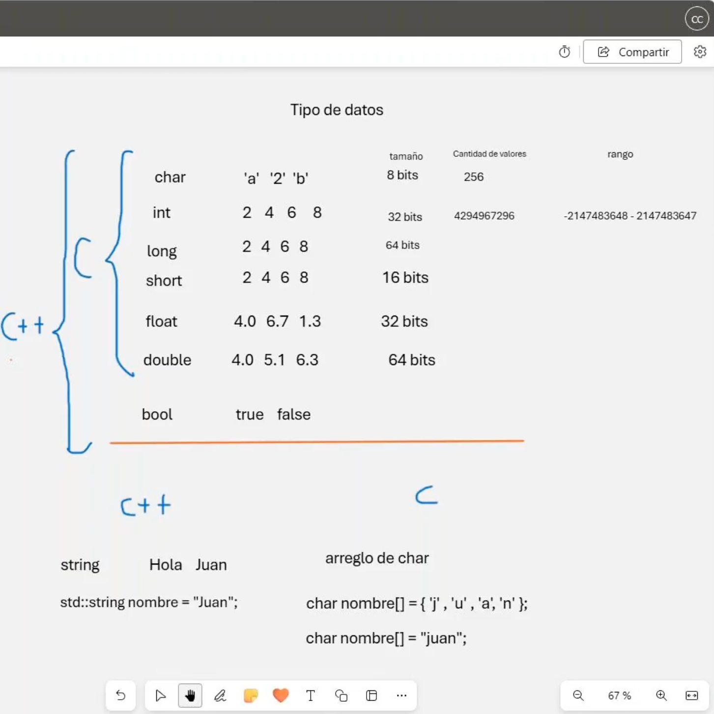

# 🛠️ Clase 2: Tipos de datos

En esta clase, profundizamos en los **tipos de datos básicos** disponibles en **C y C++**, comparando sus diferencias, tamaños, rangos y ejemplos de uso. Comprender los tipos de datos es fundamental para gestionar correctamente la memoria y las operaciones en nuestros programas.

---

## 📖 Contenido

### **1️⃣ Tipos de Datos y Propiedades**

A continuación, se presentan los tipos de datos ordenados por complejidad y uso, comenzando con los más básicos:

| Tipo de Dato | Ejemplo         | Tamaño | Cantidad de Valores    | Rango                                |
|--------------|-----------------|--------|------------------------|--------------------------------------|
| **`bool`**   | `true`, `false` | 1 bit  | 2                      | `true` o `false`                    |
| **`char`**   | `'a'`, `'2'`    | 8 bits | 256                    | -128 a 127 (signed) o 0 a 255 (unsigned) |
| **`short`**  | `2`, `4`        | 16 bits| 65,536                 | -32,768 a 32,767                    |
| **`int`**    | `2`, `4`, `6`   | 32 bits| 4,294,967,296          | -2,147,483,648 a 2,147,483,647      |
| **`long`**   | `2`, `4`, `6`   | 64 bits| Muy amplio             | Depende de la implementación        |
| **`float`**  | `4.0`, `6.7`    | 32 bits| Números decimales      | Precisión simple                    |
| **`double`** | `4.0`, `5.1`    | 64 bits| Números decimales      | Precisión doble                     |
| **`string`** | `"Hola Mundo"`  | Dinámico | Ilimitado (según memoria) | Depende del tamaño de la cadena |

---

### **2️⃣ Diferencias entre C y C++**

1. **Strings:**
    - **En C:** Utiliza arreglos de caracteres (`char[]`) o punteros terminados en `\0`.
      ```c
      char nombre[] = {'L', 'i', 'm', 'a', '\0'};
      char nombre[] = "Lima";
      ```
    - **En C++:** Utiliza el tipo `std::string` para gestionar cadenas de caracteres con métodos incorporados.
      ```cpp
      std::string nombre = "Lima";
      ```

2. **Control sobre el tamaño:**
    - En **C++**, podemos usar clases para manejar tipos de datos dinámicamente.
    - En **C**, debemos definir todo con mayor control manual (memoria estática o dinámica).

---

## 🖼️ Captura de Pantalla

A continuación, se muestra la captura utilizada en la clase:



---

## 👨‍💻 Sobre el Autor
- **👤 Nombre:** Edwin Yoner
- **📧 Contacto:** [✉️ edwinyoner@gmail.com](mailto:edwinyoner@gmail.com)
- **🔗 LinkedIn:** [🌐 linkedin.com/in/edwinyoner](https://www.linkedin.com/in/edwinyoner)
- **📚 Especialización:** Tipos de Datos y Programación en **C/C++**
- **🏫 Centro de Especialización:**
    - **Nombre:** [UMAKER S.A.C.](https://umakergroup.com/)
