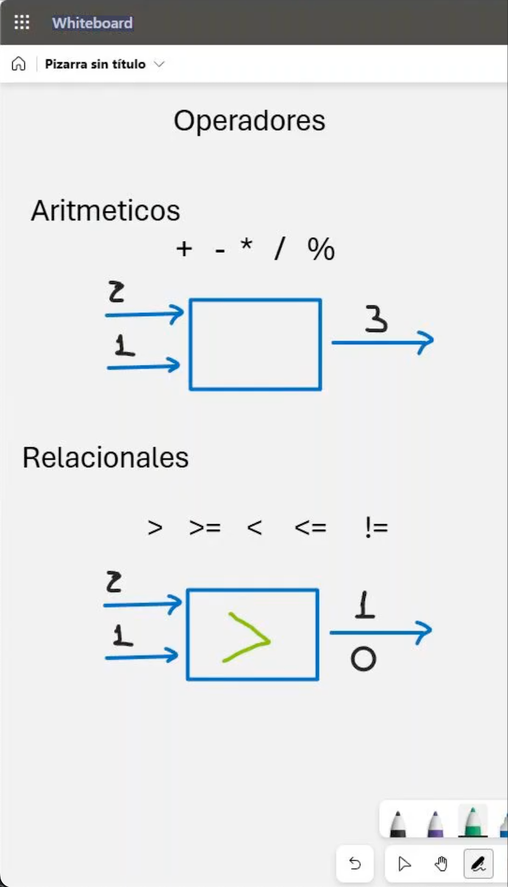

# 🛠️ Clase 3: Operadores

En esta clase, exploramos los **operadores básicos** disponibles en **C y C++**, que son fundamentales para realizar cálculos, comparaciones y tomar decisiones en nuestros programas.

---

## 📖 Contenido

### **1️⃣ Tipos de Operadores**

A continuación, se presentan los operadores categorizados según su funcionalidad y con ejemplos prácticos de uso:

#### **➕ Operadores Aritméticos**

Estos operadores realizan cálculos matemáticos básicos:

| Operador | Ejemplo | Operación          | Resultado                             |
|----------|---------|--------------------|---------------------------------------|
| `+`      | `a + b` | Suma               | Suma `a` con `b`                      |
| `-`      | `a - b` | Resta              | Resta `b` de `a`                      |
| `*`      | `a * b` | Multiplicación     | Multiplica `a` con `b`                |
| `/`      | `a / b` | División           | Divide `a` entre `b`                  |
| `%`      | `a % b` | Módulo (resto)     | Resto de la división de `a` entre `b` |

#### **📈 Operadores de Incremento y Decremento**

Estos operadores aumentan o disminuyen el valor de una variable en 1. Tienen dos variantes:

| Operador        | Ejemplo          | Operación                    | Resultado                                                         |
|------------------|------------------|------------------------------|-------------------------------------------------------------------|
| `++var` (Preincremento) | `++z`            | Incrementa `z` antes de usarla  | Si `z = 1`, `++z` será `2` y luego se usará el valor incrementado |
| `var++` (Postincremento) | `z++`            | Usa `z` y luego la incrementa  | Si `z = 1`, `z++` será `1` al usarla, pero después será `3`       |
| `--var` (Predecremento) | `--z`            | Decrementa `z` antes de usarla  | Si `z = 1`, `--z` será `0` y luego se usará el valor decrementado |
| `var--` (Postdecremento) | `z--`            | Usa `z` y luego la decrementa  | Si `z = 1`, `z--` será `1` al usarla, pero después será `1`       |

#### **🔄 Operadores Relacionales**

Estos operadores comparan dos valores y retornan un valor booleano (`true` o `false`):

| Operador | Ejemplo          | Operación                | Resultado   |
|----------|------------------|--------------------------|-------------|
| `>`      | `z > 1`          | Mayor que                | `true` si `z` es mayor que `1` |
| `>=`     | `z >= 1`         | Mayor o igual que        | `true` si `z` es mayor o igual que `1` |
| `<`      | `z < 1`          | Menor que                | `true` si `z` es menor que `1` |
| `<=`     | `z <= 1`         | Menor o igual que        | `true` si `z` es menor o igual que `1` |
| `==`     | `z == 1`         | Igualdad                 | `true` si `z` es igual a `1` |
| `!=`     | `z != 1`         | Desigualdad              | `true` si `z` no es igual a `1` |

---

### **⛔ Operadores Lógicos**
Permiten realizar operaciones lógicas entre valores booleanos.

| Operador | Descripción                       | Ejemplo       |
|----------|-----------------------------------|---------------|
| `&&`     | AND lógico (verdadero si ambos son `true`) | `a && b`   |
| `\|\|`     | OR lógico (verdadero si uno es `true`)    | `a \|\| b`   |
| `!`      | NOT lógico (invierte el valor)            | `!a`       |

        Tabla de Verdad de Operadores Lógicos
         _________________________________________________
        | `a`    | `b`    | `a && b` | `a || b` | `!a`    |
        |--------|--------|----------|----------|---------|
        | `true` | `true` | `true`   | `true`   | `false` |
        | `true` | `false`| `false`  | `true`   | `false` |
        | `false`| `true` | `false`  | `true`   | `true`  |
        | `false`| `false`| `false`  | `false`  | `true`  |
         _________________________________________________
---

### **2️⃣ Diferencias entre C y C++**

1. **Booleanos:**
    - En **C**, utilizamos `_Bool` o valores enteros (`0` para falso y `1` para verdadero).
      ```c
      _Bool resultado = (z > 1);
      ```
    - En **C++**, podemos usar directamente `bool` con valores `true` o `false`.
      ```cpp
      bool resultado = (z > 1);
      ```

2. **Sobrecarga de Operadores:**
    - En **C++**, los operadores pueden ser sobrecargados para usarse con clases personalizadas.
    - En **C**, no es posible sobrecargar operadores.

---

## 🖼️ Captura de Pantalla

A continuación, se muestra la captura utilizada en la clase:



---

## 👨‍💻 Sobre el Autor
- **👤 Nombre:** Edwin Yoner
- **📧 Contacto:** [✉️ edwinyoner@gmail.com](mailto:edwinyoner@gmail.com)
- **🔗 LinkedIn:** [🌐 linkedin.com/in/edwinyoner](https://www.linkedin.com/in/edwinyoner)
- **📚 Especialización:** Operadores y Control de Flujo en **C/C++**
- **🏫 Centro de Especialización:**
    - **Nombre:** [UMAKER S.A.C.](https://umakergroup.com/)