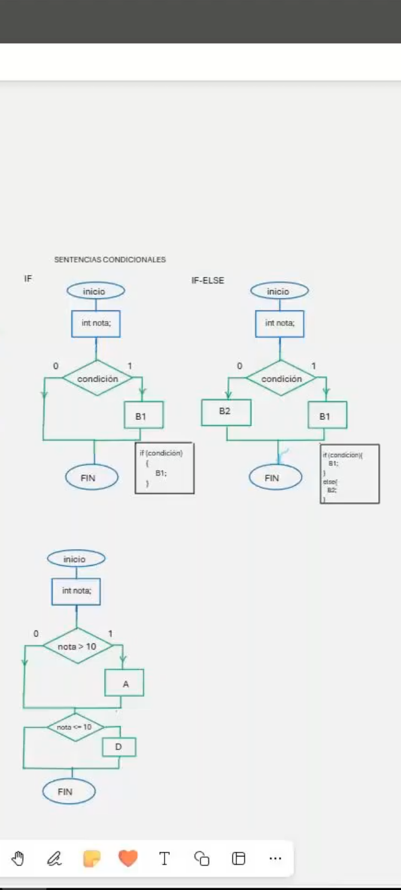
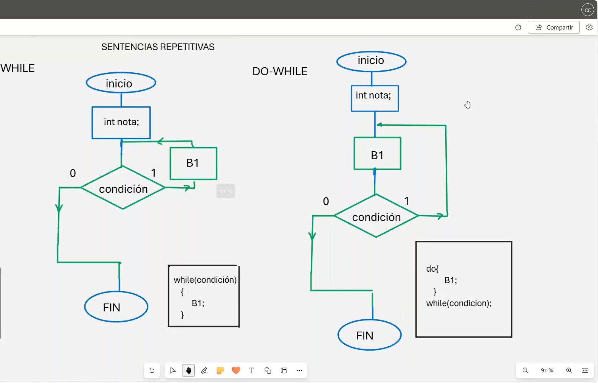
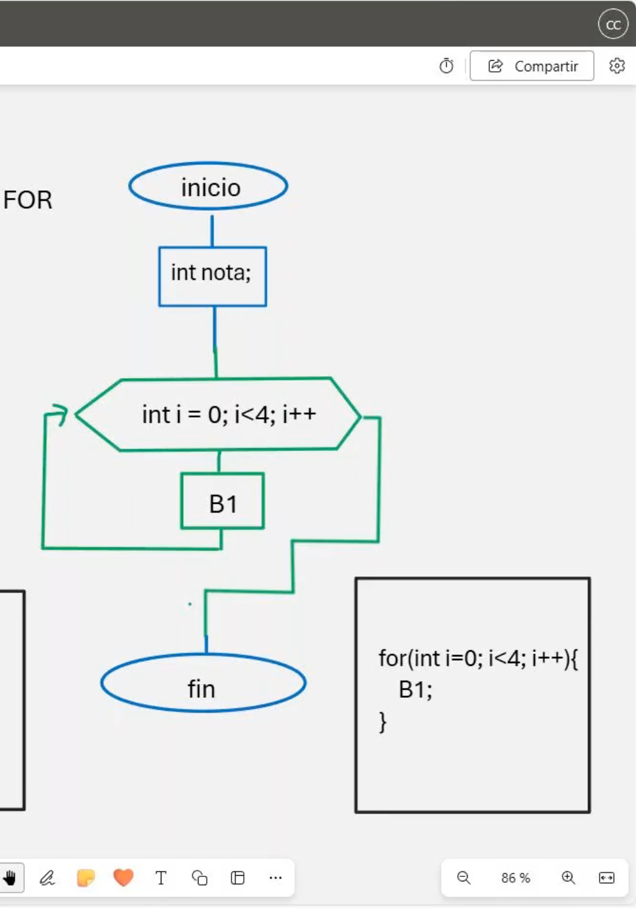

# 💻 Clase 4: Sentencias I

En esta clase, exploramos las **sentencias condicionales** y **bucles** en **C y C++**, herramientas clave para controlar el flujo de un programa según condiciones y repeticiones. Además, analizamos el uso de `switch` para manejar múltiples condiciones.

---

## 📖 Contenido

### **1️⃣ Sentencias Condicionales**

#### **✅ if y if-else**
Las sentencias `if` y `if-else` se utilizan para ejecutar bloques de código según una condición.

| Estructura         | Descripción                                           | Ejemplo                                    |
|--------------------|-------------------------------------------------------|--------------------------------------------|
| `if`              | Ejecuta un bloque si la condición es verdadera.        | `if (a > b) { printf("a es mayor que b"); }` |
| `if-else`         | Ejecuta un bloque si la condición es verdadera; de lo contrario, ejecuta otro. | `if (a > b) { printf("a es mayor"); } else { printf("b es mayor"); }` |

#### **🔁 switch**
La sentencia `switch` se utiliza para ejecutar diferentes bloques de código según el valor de una variable.

| Estructura         | Descripción                                           | Ejemplo                                    |
|--------------------|-------------------------------------------------------|--------------------------------------------|
| `switch`          | Evalúa el valor de una expresión y ejecuta el caso correspondiente. | ```c switch (opcion) { case 1: printf("Uno"); break; default: printf("Otro"); }``` |

---

### **2️⃣ Bucles**

#### **🔄 while y do-while**
Los bucles `while` y `do-while` permiten repetir un bloque de código mientras una condición sea verdadera.

| Estructura         | Descripción                                           | Ejemplo                                    |
|--------------------|-------------------------------------------------------|--------------------------------------------|
| `while`           | Evalúa la condición antes de ejecutar el bloque.       | `while (a < 10) { printf("%d", a++); }`    |
| `do-while`        | Ejecuta el bloque al menos una vez, luego evalúa la condición. | `do { printf("%d", a++); } while (a < 10);` |

---

#### **🔂 for**
El bucle `for` es ideal para iteraciones con un número conocido de repeticiones.

| Estructura         | Descripción                                           | Ejemplo                                    |
|--------------------|-------------------------------------------------------|--------------------------------------------|
| `for`             | Combina inicialización, condición y actualización.    | for (int i = 0; i < 10; i++) { printf("%d", i); }` |

---

## 🖼️ Capturas de Pantalla

A continuación, se muestran las capturas utilizadas en esta clase:

### 1️⃣ Sentencias Condicionales (if, if-else, switch)


### 2️⃣ Bucles (while y do-while)


### 3️⃣ Bucle for


---

## 🚀 Diferencias entre C y C++

### 1️⃣ `switch` con `string`
En **C++**, el `switch` no soporta directamente cadenas (`std::string`), pero puedes usar literales de caracteres. En **C**, solo acepta valores enteros o constantes de tipo `char`.

```cpp
// No válido en C ni C++
switch (miString) {
    case "Hola": std::cout << "Hola"; break;
    default: std::cout << "Otro"; break;
}
```

---

## 👨‍💻 Sobre el Autor
- **👤 Nombre:** Edwin Yoner
- **📧 Contacto:** [✉️ edwinyoner@gmail.com](mailto:edwinyoner@gmail.com)
- **🔗 LinkedIn:** [🌐 linkedin.com/in/edwinyoner](https://www.linkedin.com/in/edwinyoner)