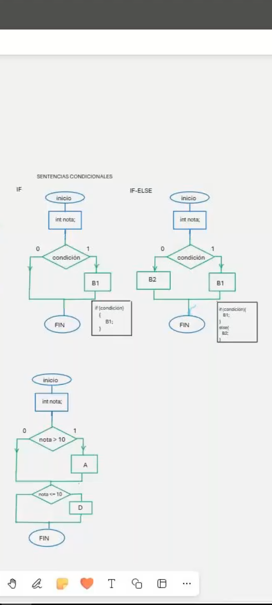
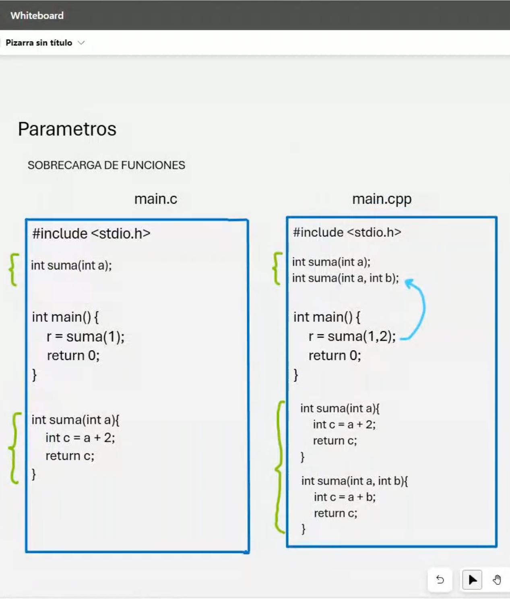
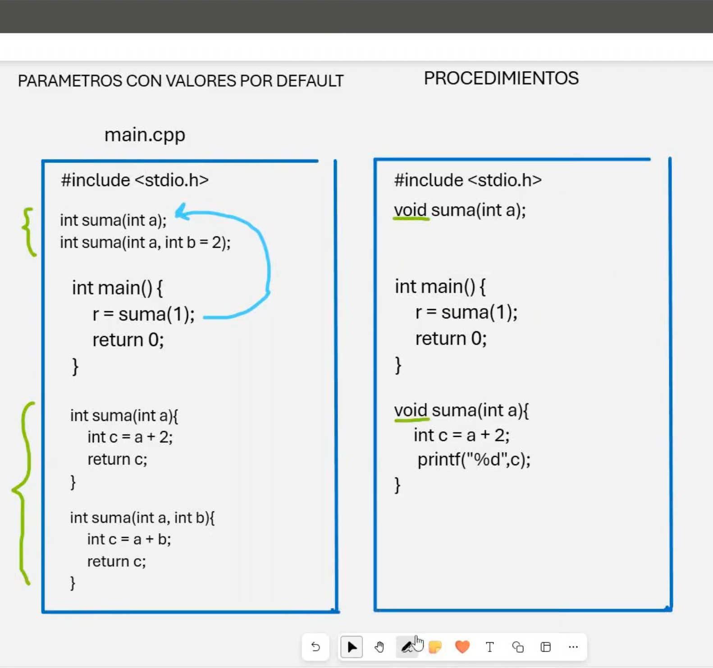

# 💻 Clase 5: Funciones I

En esta clase, exploramos los fundamentos de **funciones**, la **sobrecarga de funciones**, el uso de **parámetros por defecto** y el concepto de **procedimientos** en **C y C++**. Estos elementos son esenciales para estructurar y modularizar programas.

---

## 📖 Contenido

### **1️⃣ Fundamentos de Funciones**

Las funciones son bloques de código que realizan una tarea específica. Nos permiten reutilizar código, mejorar la legibilidad y simplificar el mantenimiento.

| Concepto          | Descripción                                              | Ejemplo                                    |
|-------------------|----------------------------------------------------------|--------------------------------------------|
| **Prototipo**     | Declaración de la función antes de usarla.                | `int suma(int x, int y);`                  |
| **Definición**    | Implementación de la lógica de la función.                | `int suma(int x, int y) { return x + y; }` |
| **Invocación**    | Llamada a la función en el programa principal.            | `resultado = suma(2, 3);`                  |

---

### **2️⃣ Sobrecarga de Funciones**

En **C++**, la **sobrecarga** permite tener múltiples funciones con el mismo nombre pero diferente número o tipo de parámetros. Esto no es posible en **C**.

| Lenguaje          | Característica                                           | Ejemplo                                    |
|-------------------|----------------------------------------------------------|--------------------------------------------|
| **C**            | No soporta sobrecarga.                                    | Una sola versión de la función `suma`.     |
| **C++**          | Soporta múltiples versiones de una misma función.         | `int suma(int a); int suma(int a, int b);` |

---

### **3️⃣ Parámetros con Valores por Defecto**

En **C++**, podemos asignar valores por defecto a los parámetros de una función. Esto permite omitir argumentos al llamar a la función.

| Ventaja           | Ejemplo                                    |
|-------------------|--------------------------------------------|
| Mayor flexibilidad | `int suma(int x, int y = 2);`             |
| Invocación        | `suma(3); // Usa 3 y 2 como valores.`      |

---

### **4️⃣ Procedimientos**

Un **procedimiento** es una función que no devuelve valores, representada por el tipo `void`. Estos son útiles para ejecutar tareas específicas como imprimir datos.

| Concepto          | Ejemplo                                    |
|-------------------|--------------------------------------------|
| Definición        | `void muestraResultado(int x) { printf("%d", x); }` |
| Invocación        | `muestraResultado(5);`                    |

---

## 🚀 Diferencias entre C y C++

### 1️⃣ Sobrecarga
- **C++** soporta la sobrecarga de funciones.
- **C** requiere nombres únicos para cada función.

### 2️⃣ Parámetros por defecto
- Exclusivo de **C++**.

### 3️⃣ Procedimientos
- Ambos lenguajes soportan funciones `void`.

---

## 🖼️ Capturas de Pantalla

A continuación, las capturas utilizadas en esta clase:

1️⃣ **Funciones**  

2️⃣ **Sobrecarga de Funciones**  

3️⃣ **Parámetros y Procedimientos**  

---

## 👨‍💻 Sobre el Autor

- **👤 Nombre:** Edwin Yoner
- **📧 Contacto:** [✉️ edwinyoner@gmail.com](mailto:edwinyoner@gmail.com)
- **🔗 LinkedIn:** [🌐 linkedin.com/in/edwinyoner](https://www.linkedin.com/in/edwinyoner)