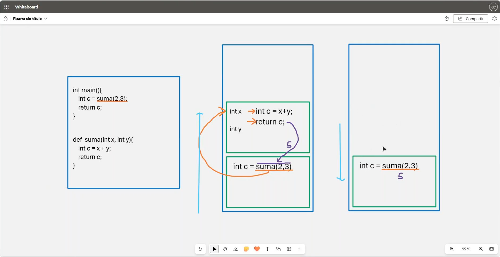
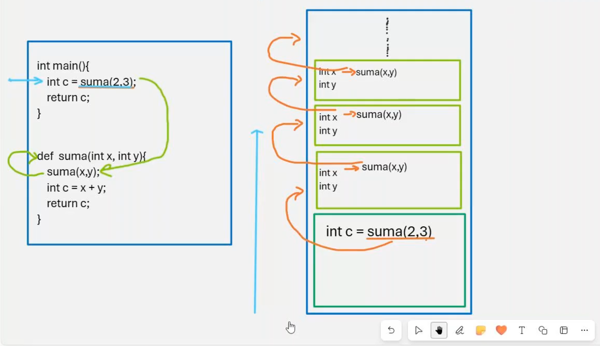
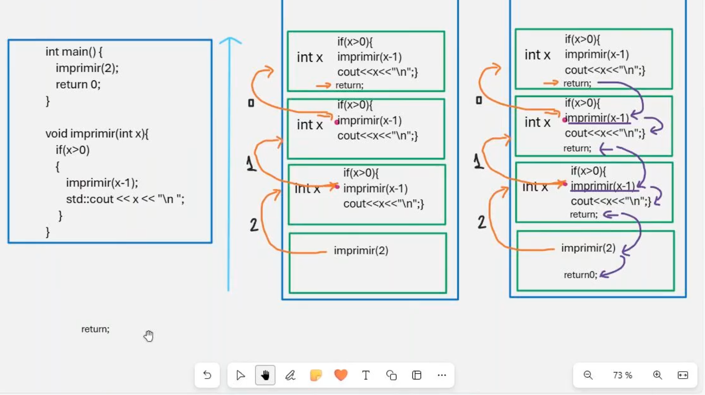

# 💻 Clase 6: Funciones II

En esta clase, profundizamos en los conceptos de **funciones** en **C y C++**, explorando el manejo de **parámetros por valor**, el comportamiento de la **recursión**, y el uso de la **pila de ejecución**. Estos aspectos son clave para comprender cómo se estructuran los programas y cómo se gestionan las llamadas a funciones.

---

## 📖 Contenido

### **1️⃣ Parámetros por Valor**

Cuando pasamos parámetros por valor, se envía una copia de los valores al cuerpo de la función. Esto asegura que los valores originales no sean modificados.  
Este mecanismo es el único método de paso de parámetros en **C** y **C++** por defecto.

| Concepto          | Descripción                                              | Ejemplo                                    |
|-------------------|----------------------------------------------------------|--------------------------------------------|
| **Paso por valor** | Los valores originales no son afectados.                 | `int suma(int x, int y) { return x + y; }` |

---

### **2️⃣ Recursión**

La recursión ocurre cuando una función se llama a sí misma directa o indirectamente. Es una técnica útil para resolver problemas que pueden ser descompuestos en subproblemas más pequeños.

| Concepto          | Descripción                                              | Ejemplo                                    |
|-------------------|----------------------------------------------------------|--------------------------------------------|
| **Caso base**     | Detiene la recursión para evitar un bucle infinito.       | `if (x == 0) return;`                      |
| **Llamada recursiva** | La función se invoca dentro de su definición.         | `imprimir(x - 1);`                         |

Ejemplo en **C++**:
```cpp
void imprimir(int x) {
    if (x > 0) {
        imprimir(x - 1);
        std::cout << x << "\n";
    }
}
```
### **3️⃣ Pila de Ejecución**

Cada vez que se llama a una función, se crea un nuevo marco (frame) en la pila de ejecución que contiene las variables locales y los parámetros de esa función. Una vez que la función termina, su marco se elimina.

| Ventaja           | Descripción                                              |
|-------------------|----------------------------------------------------------|
| **Orden LIFO**    | Last In, First Out: la última llamada es la primera en completarse. |
| **Aislamiento**   | Cada función tiene su propio espacio para variables.      |

---

## 🚀 Diferencias entre C y C++

### 1️⃣ Manejo de Pila de Llamadas

- Ambas lenguas utilizan la pila para manejar llamadas a funciones, pero **C++** facilita la depuración con características modernas como excepciones.

### 2️⃣ Recursión

- La recursión es soportada de manera idéntica en **C** y **C++**.

---

## 🖼️ Capturas de Pantalla

A continuación, las capturas utilizadas en esta clase:

1️⃣ **Flujo Básico de Funciones**  


2️⃣ **Pila de Llamadas Recursivas**  


3️⃣ **Comportamiento Recursivo Detallado**  


---

## 👨‍💻 Sobre el Autor

- **👤 Nombre:** Edwin Yoner
- **📧 Contacto:** [✉️ edwinyoner@gmail.com](mailto:edwinyoner@gmail.com)
- **🔗 LinkedIn:** [🌐 linkedin.com/in/edwinyoner](https://www.linkedin.com/in/edwinyoner)
