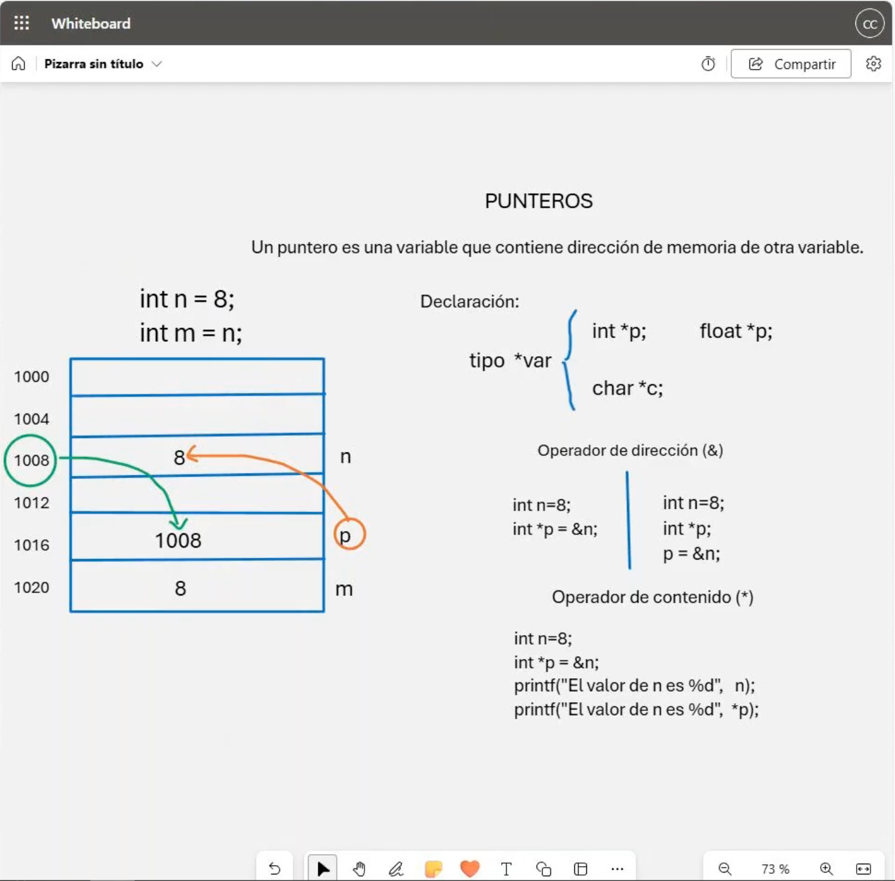

# 💻 Clase 7: Punteros

En esta clase, exploramos el concepto de **punteros** en **C** y **C++**, una herramienta fundamental para trabajar con direcciones de memoria. Aprender a usar punteros permite manejar datos de manera más eficiente y entender mejor el funcionamiento interno de los programas.

---

## 📖 Contenido

### **1️⃣ ¿Qué es un Puntero?**
Un puntero es una variable que contiene la dirección de memoria de otra variable. Esto permite manipular datos almacenados en ubicaciones específicas de la memoria.

---

### **2️⃣ Declaración de Punteros**
Los punteros se declaran especificando el tipo de dato al que apuntarán, seguido del operador `*` y el nombre de la variable.

| Tipo de Puntero  | Declaración       |
|------------------|-------------------|
| `int`           | `int *p;`         |
| `float`         | `float *p;`       |
| `char`          | `char *c;`        |

---

### **3️⃣ Operadores Relacionados con Punteros**

#### **✅ Operador de Dirección (`&`):**
Este operador devuelve la dirección de memoria de una variable.

| Código                          | Descripción                            |
|---------------------------------|----------------------------------------|
| `int n = 8;`                    | Declaración de una variable `n` con valor `8`. |
| `int *p = &n;`                  | Asignación de la dirección de `n` a `p`.       |

#### **✅ Operador de Contenido (`*`):**
Este operador devuelve el valor almacenado en la dirección de memoria a la que apunta el puntero.

| Código                          | Descripción                            |
|---------------------------------|----------------------------------------|
| `int n = 8;`                    | Declaración de una variable `n`.               |
| `int *p = &n;`                  | El puntero `p` apunta a la dirección de `n`.   |
| `printf("El valor de n es %d", n);` | Imprime el valor de `n` directamente.         |
| `printf("El valor de n es %d", *p);` | Imprime el valor de `n` a través de `p`.      |

---

## 📘 Ejemplos en C y C++

### **Ejemplo en C**
```c
#include <stdio.h>

int main() {
    int n = 8;
    int *p = &n;

    printf("El valor de n es %d\n", n);
    printf("El valor de n (a través de p) es %d\n", *p);

    return 0;
}
```

### **Ejemplo en C++**
```cpp
#include <iostream>
using namespace std;

int main() {
    int n = 8;
    int *p = &n;

    cout << "El valor de n es " << n << endl;
    cout << "El valor de n (a través de p) es " << *p << endl;

    return 0;
}
```

---

## 🖼️ Captura de Pantalla
A continuación, se muestra la captura utilizada en esta clase:

1️⃣ **Representación Gráfica de Punteros**


---

## 👨‍💻 Sobre el Autor
- **👤 Nombre:** Edwin Yoner
- **📧 Contacto:** [✉️ edwinyoner@gmail.com](mailto:edwinyoner@gmail.com)
- **🔗 LinkedIn:** [🌐 linkedin.com/in/edwinyoner](https://www.linkedin.com/in/edwinyoner)
