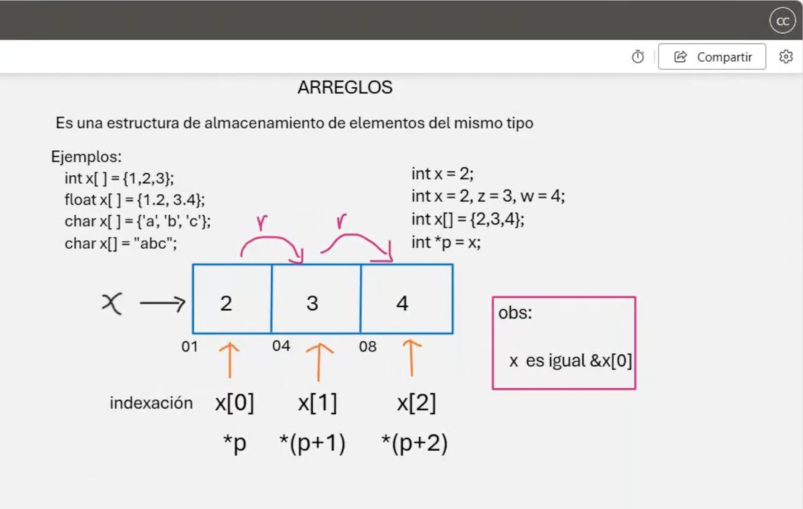
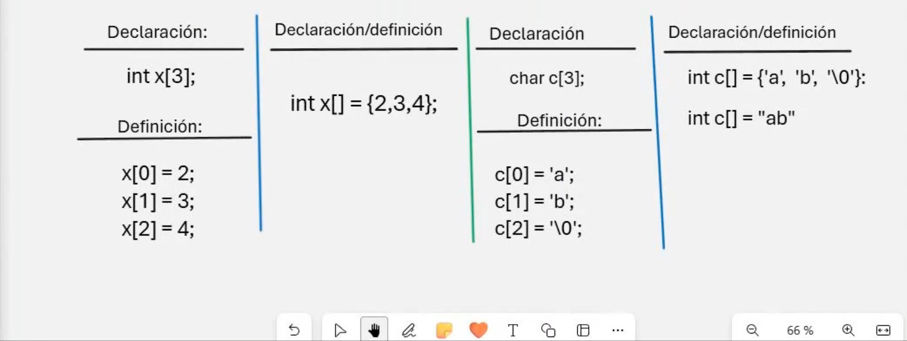

# 💻 Clase 8: Arrays

En esta clase, exploramos el concepto de **Arrays** en **C** y **C++**, una estructura de datos fundamental que permite almacenar y manejar colecciones de elementos de un mismo tipo de forma ordenada y eficiente.

---

## 📚 Contenido

### **1️⃣ ¿Qué es un Array?**
Un **array** (o arreglo) es una estructura de datos que almacena una colección de valores del mismo tipo en ubicaciones de memoria contiguas. Se accede a cada elemento del array mediante un índice.

---

### **2️⃣ Declaración de Arrays**
Para declarar un array, se especifica el tipo de dato, seguido del nombre del array y el número de elementos entre corchetes `[]`.

| Tipo de Array  | Declaración            | Ejemplo                 |
|----------------|-------------------------|-------------------------|
| `int`         | `int arr[5];`          | Arreglo de 5 enteros.  |
| `float`       | `float arr[10];`       | Arreglo de 10 flotantes. |
| `char`        | `char arr[20];`        | Arreglo de 20 caracteres. |

---

### **3️⃣ Inicialización de Arrays**
Un array puede ser inicializado en el momento de su declaración. Se utilizan llaves `{}` para asignar valores.

| Declaración                  | Descripción                                   |
|------------------------------|-----------------------------------------------|
| `int arr[3] = {1, 2, 3};`   | Inicializa un array de 3 enteros.            |
| `float arr[4] = {1.1, 2.2};`| Los elementos no especificados se inicializan en `0`. |
| `char arr[5] = {'a', 'b'};` | Arreglo de caracteres.                       |

---

## 📘 Ejemplo de Uso

### **Ejemplo en C**
```c
#include <stdio.h>

int main() {
    int arr[5] = {1, 2, 3, 4, 5};

    for (int i = 0; i < 5; i++) {
        printf("Elemento %d: %d\n", i, arr[i]);
    }

    return 0;
}
```

### **Ejemplo en C++**
```cpp
#include <iostream>
using namespace std;

int main() {
    int arr[5] = {1, 2, 3, 4, 5};

    for (int i = 0; i < 5; i++) {
        cout << "Elemento " << i << ": " << arr[i] << endl;
    }

    return 0;
}
```

---

## 🖼️ Capturas de Pantalla
A continuación, se muestran las capturas utilizadas en esta clase:

1️⃣ **Representación Gráfica de Arrays**


2️⃣ **Acceso y Modificación de Arrays**


---

## 👨‍💻 Sobre el Autor
- **👤 Nombre:** Edwin Yoner
- **📧 Contacto:** [✉️ edwinyoner@gmail.com](mailto:edwinyoner@gmail.com)
- **🌐 LinkedIn:** [🌐 linkedin.com/in/edwinyoner](https://www.linkedin.com/in/edwinyoner)