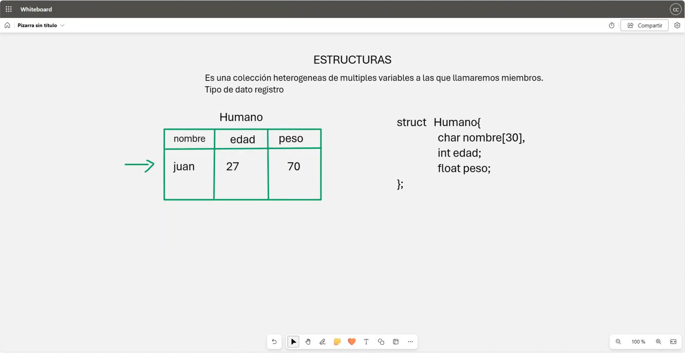
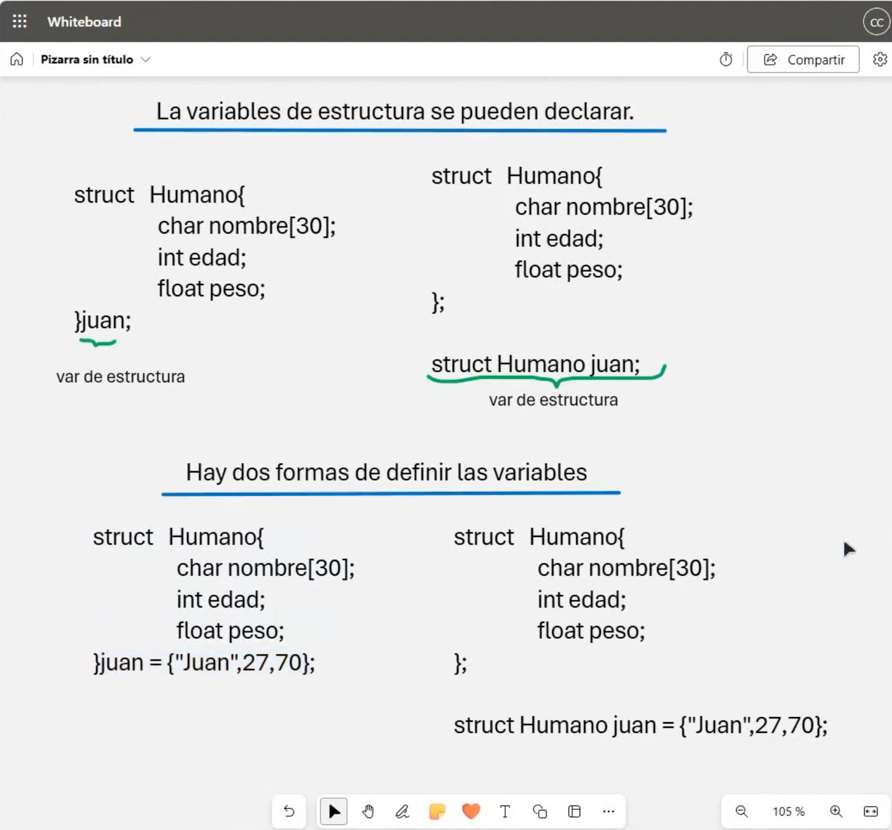
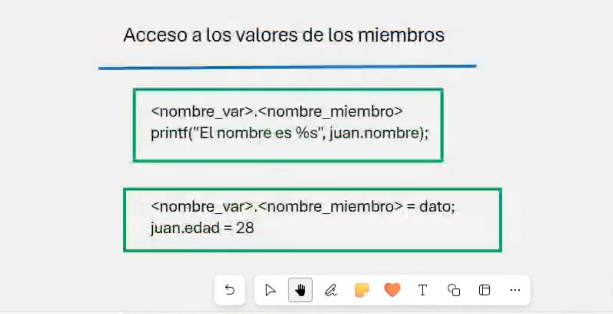

# 💻 Clase 9: Estructuras

En esta clase, exploramos el concepto de **Estructuras** en **C** y **C++**, una herramienta poderosa que permite agrupar múltiples variables de diferentes tipos en una sola unidad lógica.

---

## 📚 Contenido

### **1️⃣ ¿Qué es una Estructura?**
Una **estructura** en C y C++ es una colección de variables heterogéneas (de diferentes tipos) que se agrupan bajo un mismo nombre. Cada variable dentro de la estructura se conoce como **miembro**.

**Sintaxis básica de una estructura:**
```c
struct NombreEstructura {
    tipo1 miembro1;
    tipo2 miembro2;
    ...
};
```

---

### **2️⃣ Declaración de Estructuras**
La declaración de una estructura define cómo estará compuesta. Cada miembro debe tener un tipo de dato y un nombre.

| Componente           | Declaración                        | Ejemplo                                  |
|-----------------------|------------------------------------|------------------------------------------|
| Definición de Estructura | `struct Humano { ... };`         | Define una estructura llamada `Humano`. |
| Variable de Estructura   | `struct Humano juan;`           | Declara una variable `juan` de tipo `Humano`. |

**Ejemplo de código:**
```c
struct Humano {
    char nombre[30];
    int edad;
    float peso;
};

struct Humano juan;
```

---

### **3️⃣ Inicialización de Estructuras**
Las estructuras pueden ser inicializadas al momento de su declaración utilizando llaves `{}`.

| Declaración                            | Descripción                                   |
|---------------------------------------|-----------------------------------------------|
| `struct Humano juan = {"Juan", 27, 70};` | Inicializa los valores de los miembros.      |

**Ejemplo:**
```c
struct Humano {
    char nombre[30];
    int edad;
    float peso;
};

struct Humano juan = {"Juan", 27, 70};
```

---

### **4️⃣ Acceso y Modificación de Miembros**
Para acceder a los miembros de una estructura, utilizamos el operador de punto `.` junto al nombre de la variable.

| Operación                        | Sintaxis                           | Ejemplo                          |
|----------------------------------|------------------------------------|----------------------------------|
| Acceder a un miembro             | `<nombre_var>.<nombre_miembro>`    | `juan.nombre`                    |
| Modificar un miembro             | `<nombre_var>.<nombre_miembro> = valor;` | `juan.edad = 28;`                |

**Ejemplo de código:**
```c
#include <stdio.h>

struct Humano {
    char nombre[30];
    int edad;
    float peso;
};

int main() {
    struct Humano juan = {"Juan", 27, 70};

    // Acceder a los valores
    printf("Nombre: %s\n", juan.nombre);
    printf("Edad: %d\n", juan.edad);
    printf("Peso: %.2f\n", juan.peso);

    // Modificar valores
    juan.edad = 28;
    printf("Nueva edad: %d\n", juan.edad);

    return 0;
}
```

---

## 🖼️ Capturas de Pantalla
A continuación, se muestran las capturas utilizadas en esta clase:

1️⃣ **Definición de Estructuras**


2️⃣ **Declaración e Inicialización**


3️⃣ **Acceso y Modificación de Miembros**


---

## 👨‍💻 Sobre el Autor
- **👤 Nombre:** Edwin Yoner
- **📧 Contacto:** [✉️ edwinyoner@gmail.com](mailto:edwinyoner@gmail.com)
- **🌐 LinkedIn:** [🌐 linkedin.com/in/edwinyoner](https://www.linkedin.com/in/edwinyoner)