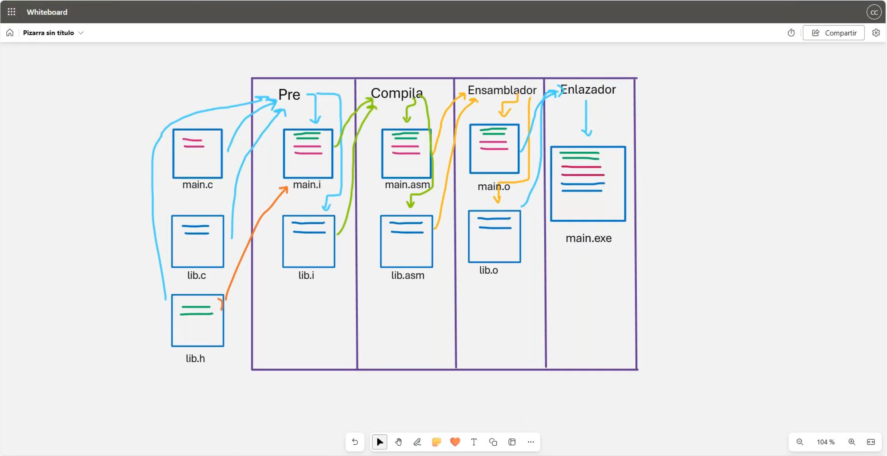

# 💻 Clase 11: Directivas del Preprocesador

En esta clase, exploramos las **directivas del preprocesador** en **C** y **C++**, herramientas fundamentales que permiten realizar operaciones previas a la compilación del código fuente.

---

## 📚 Contenido

### **1️⃣ ¿Qué es el Preprocesador?**
El **preprocesador** es una etapa previa a la compilación que realiza transformaciones en el código fuente antes de que éste sea compilado. Estas transformaciones son definidas por las **predirectivas**, que inician con el símbolo `#`.

**Ejemplo de preprocesador:**
```c
#include <stdio.h>
#define PI 3.14159
```

En **C++**, las directivas funcionan de manera similar, pero suelen usarse junto con características específicas del lenguaje, como clases o templates:
```cpp
#include <iostream>
#define MAX 100
```

---

### **2️⃣ Principales Directivas del Preprocesador**
A continuación, se describen las principales directivas utilizadas en C y C++:

| Predirectiva      | Descripción                                                        | Ejemplo                           |
|-------------------|--------------------------------------------------------------------|-----------------------------------|
| `#include`        | Incluye archivos de cabecera.                                      | `#include <stdio.h>` (C) / `#include <iostream>` (C++) |
| `#define`         | Define constantes o macros.                                        | `#define MAX 100`                |
| `#undef`          | Elimina una definición anterior de macro o constante.              | `#undef MAX`                     |
| `#if`, `#elif`, `#else`, `#endif` | Condicionales para compilar bloques de código.                      | `#if defined(DEBUG)`             |
| `#pragma`         | Instrucciones especiales para el compilador.                      | `#pragma warning(disable:4996)`  |
| `#error`          | Genera un mensaje de error si se cumple cierta condición.         | `#error "Error en el código"` |

---

### **3️⃣ Ejemplo Completo**
A continuación, se muestra un ejemplo completo que utiliza varias directivas en **C**:

```c
#include <stdio.h>
#define DEBUG 1
#define MAX 100

int main() {
    #ifdef DEBUG
        printf("Debugging activado\n");
    #endif

    printf("El valor máximo es: %d\n", MAX);

    #undef MAX
    #define MAX 50

    printf("El nuevo valor máximo es: %d\n", MAX);

    #if MAX > 75
        printf("MAX es mayor a 75\n");
    #else
        printf("MAX no es mayor a 75\n");
    #endif

    return 0;
}
```

En **C++**, el ejemplo puede adaptarse con funciones específicas del lenguaje:

```cpp
#include <iostream>
#define DEBUG 1
#define MAX 100

int main() {
    #ifdef DEBUG
        std::cout << "Debugging activado" << std::endl;
    #endif

    std::cout << "El valor máximo es: " << MAX << std::endl;

    #undef MAX
    #define MAX 50

    std::cout << "El nuevo valor máximo es: " << MAX << std::endl;

    #if MAX > 75
        std::cout << "MAX es mayor a 75" << std::endl;
    #else
        std::cout << "MAX no es mayor a 75" << std::endl;
    #endif

    return 0;
}
```

---

### **4️⃣ Beneficios del Preprocesador**
1. **Modularidad:** Permite incluir código reutilizable mediante archivos de cabecera.
2. **Flexibilidad:** Facilita definir constantes y macros personalizadas.
3. **Control Condicional:** Compila sólo las partes necesarias del código dependiendo de las condiciones.

---

## 🖼️ Capturas de Pantalla
A continuación, se muestran las capturas relacionadas con el tema:

1️⃣ **Proceso del Preprocesador**


---

## 👨‍💻 Sobre el Autor
- **👤 Nombre:** Edwin Yoner
- **📧 Contacto:** [✉️ edwinyoner@gmail.com](mailto:edwinyoner@gmail.com)
- **🌐 LinkedIn:** [🌐 linkedin.com/in/edwinyoner](https://www.linkedin.com/in/edwinyoner)

