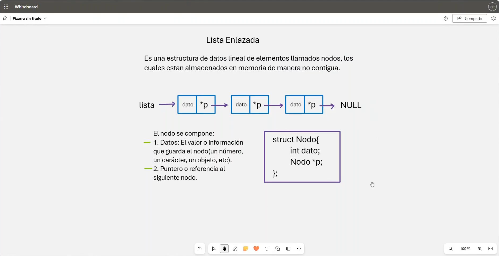
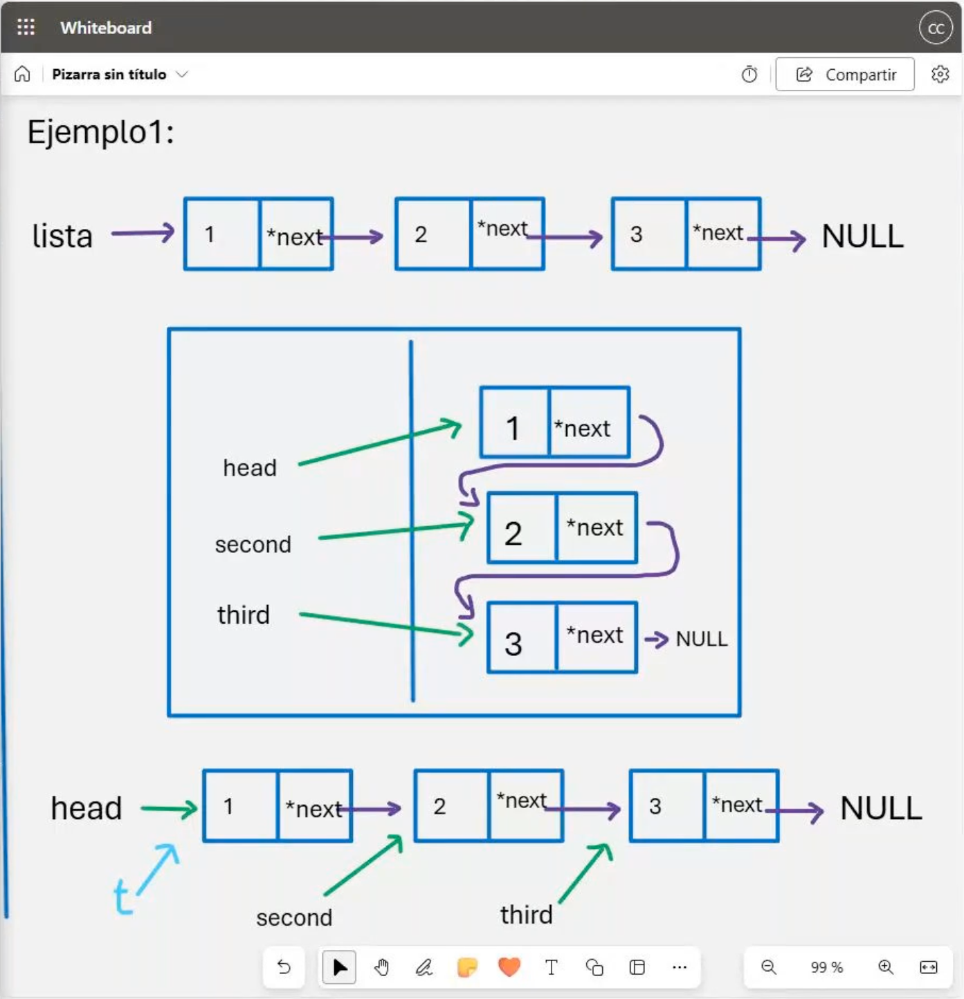

# 💻 Clase 14: Listas Enlazadas

En esta clase exploramos el concepto de **listas enlazadas** en **C** y **C++**, una estructura de datos lineal que permite almacenar elementos llamados nodos de manera no contigua en la memoria. Las listas enlazadas son fundamentales para entender estructuras dinámicas.

---

## 📚 Contenido

### **1️⃣ Introducción a las Listas Enlazadas**
Una lista enlazada es una estructura de datos compuesta por nodos. Cada nodo contiene:

1. **Datos:** La información que almacena el nodo (puede ser un número, carácter, objeto, etc.).
2. **Puntero:** Una referencia al siguiente nodo en la lista (o `NULL` si es el último nodo).

**Ejemplo de nodo en C:**
```c
struct Nodo {
    int dato;   /**< Dato almacenado en el nodo. */
    struct Nodo *p; /**< Puntero al siguiente nodo. */
};
```

**Ejemplo de nodo en C++:**
```cpp
struct Nodo {
    int dato;   /**< Dato almacenado en el nodo. */
    Nodo *p; /**< Puntero al siguiente nodo. */
};
```

---

### **2️⃣ Ventajas de las Listas Enlazadas**
- Uso eficiente de memoria: los elementos no necesitan estar contiguos.
- Tamaño dinámico: se pueden agregar o eliminar nodos en tiempo de ejecución.
- Facilitan la implementación de estructuras más complejas como pilas, colas, y árboles.

---

### **3️⃣ Tipos de Listas Enlazadas**
1. **Lista Simplemente Enlazada:** Cada nodo apunta al siguiente nodo.
2. **Lista Doblemente Enlazada:** Cada nodo apunta tanto al siguiente como al anterior nodo.
3. **Lista Circular:** El último nodo apunta al primer nodo.

---

### **4️⃣ Implementación de una Lista Enlazada Simple**

#### **C**
```c
/**
 * @file lista_enlazada.c
 * @brief Implementación de una lista enlazada en C.
 */

#include <stdio.h>
#include <stdlib.h>

/**
 * Estructura de un nodo.
 */
struct Nodo {
    int dato;               /**< Dato almacenado en el nodo. */
    struct Nodo *siguiente; /**< Puntero al siguiente nodo. */
};

/**
 * @brief Crea un nuevo nodo.
 *
 * @param dato Valor a almacenar en el nodo.
 * @return Puntero al nuevo nodo.
 */
struct Nodo *crearNodo(int dato) {
    struct Nodo *nuevo = (struct Nodo *)malloc(sizeof(struct Nodo));
    nuevo->dato = dato;
    nuevo->siguiente = NULL;
    return nuevo;
}

/**
 * @brief Imprime los elementos de la lista enlazada.
 *
 * @param cabeza Puntero al primer nodo de la lista.
 */
void imprimirLista(struct Nodo *cabeza) {
    struct Nodo *temp = cabeza;
    while (temp != NULL) {
        printf("%d -> ", temp->dato);
        temp = temp->siguiente;
    }
    printf("NULL\n");
}

int main() {
    struct Nodo *cabeza = crearNodo(1);
    cabeza->siguiente = crearNodo(2);
    cabeza->siguiente->siguiente = crearNodo(3);

    imprimirLista(cabeza);

    return 0;
}
```

#### **C++**
```cpp
/**
 * @file lista_enlazada.cpp
 * @brief Implementación de una lista enlazada en C++.
 */

#include <iostream>
using namespace std;

/**
 * Estructura de un nodo.
 */
struct Nodo {
    int dato;      /**< Dato almacenado en el nodo. */
    Nodo *siguiente; /**< Puntero al siguiente nodo. */

    /**
     * @brief Constructor del nodo.
     * @param valor Valor a almacenar en el nodo.
     */
    Nodo(int valor) : dato(valor), siguiente(nullptr) {}
};

/**
 * @brief Imprime los elementos de la lista enlazada.
 *
 * @param cabeza Puntero al primer nodo de la lista.
 */
void imprimirLista(Nodo *cabeza) {
    Nodo *temp = cabeza;
    while (temp != nullptr) {
        cout << temp->dato << " -> ";
        temp = temp->siguiente;
    }
    cout << "NULL" << endl;
}

int main() {
    Nodo *cabeza = new Nodo(1);
    cabeza->siguiente = new Nodo(2);
    cabeza->siguiente->siguiente = new Nodo(3);

    imprimirLista(cabeza);

    return 0;
}
```

---

### **5️⃣ Comparación entre C y C++**

| **Aspecto**        | **C**                                          | **C++**                                |
| ------------------ | ---------------------------------------------- | -------------------------------------- |
| **Definición**     | `struct Nodo`                                  | `struct Nodo`                          |
| **Asignación**     | `malloc` para reserva dinámica.                | `new` para reserva dinámica.           |
| **Liberación**     | `free` para liberar memoria.                   | `delete` para liberar memoria.         |
| **Acceso**         | Operaciones manuales sobre punteros.           | Uso de métodos y características de OOP. |

---

## 🖼️ Capturas de Pantalla

1️⃣ **Estructura de una Lista Enlazada Simple**


2️⃣ **Ejemplo de Lista Enlazada**


---

## 👨‍💻 Sobre el Autor
- **👤 Nombre:** Edwin Yoner
- **📧 Contacto:** [✉️ edwinyoner@gmail.com](mailto:edwinyoner@gmail.com)
- **🌐 LinkedIn:** [🌐 linkedin.com/in/edwinyoner](https://www.linkedin.com/in/edwinyoner)