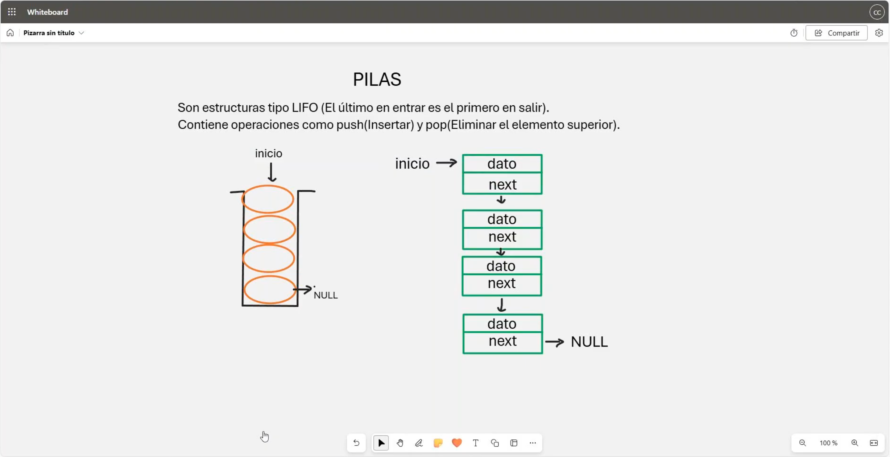
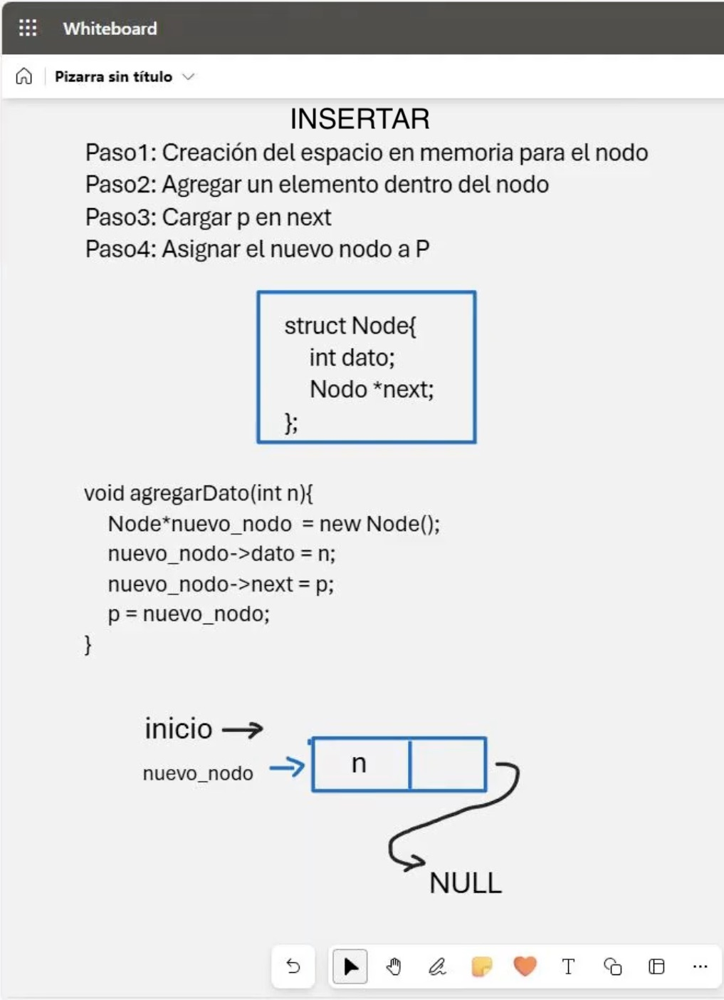
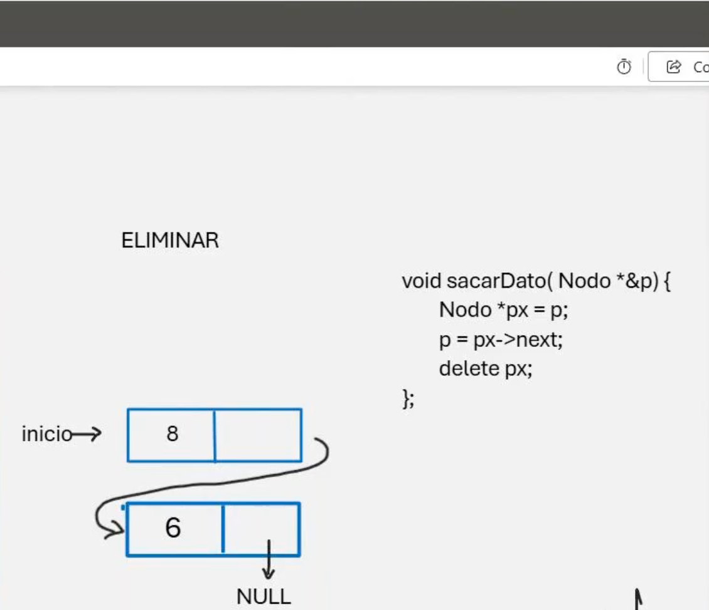

# 💻 Clase 15: Pilas

En esta clase exploramos el concepto de **pilas**, una estructura de datos fundamental que sigue el principio **LIFO** (*Last In, First Out*), donde el último elemento en entrar es el primero en salir.

---

## 📚 Contenido

### **1️⃣ Introducción a las Pilas**
Una pila es una estructura de datos que permite:
- **Insertar elementos** mediante la operación `push`.
- **Eliminar elementos** mediante la operación `pop`.

El acceso a los elementos siempre se realiza desde la parte superior de la pila (**top**).

---

### **2️⃣ Representación de una Pila**
Una pila puede representarse mediante una lista enlazada. Cada nodo contiene:
1. **Dato:** El valor almacenado.
2. **Puntero:** Una referencia al siguiente nodo en la pila.

#### Estructura del nodo en C++:
```cpp
struct Node {
    int dato; /**< Dato almacenado en el nodo. */
    Node *next; /**< Puntero al siguiente nodo. */
};
```

---

### **3️⃣ Operaciones de una Pila**

#### **a) Insertar (`push`)**
1. Crear espacio en memoria para el nuevo nodo.
2. Asignar el valor al nodo.
3. Ajustar el puntero del nuevo nodo al nodo actual en la parte superior.
4. Actualizar la parte superior de la pila.

#### Ejemplo de `push`:
```cpp
void agregarDato(int n, Node *&pila) {
    Node *nuevoNodo = new Node();
    nuevoNodo->dato = n;
    nuevoNodo->next = pila;
    pila = nuevoNodo;
}
```

#### **b) Eliminar (`pop`)**
1. Guardar una referencia temporal al nodo superior.
2. Actualizar la parte superior al siguiente nodo.
3. Liberar la memoria del nodo eliminado.

#### Ejemplo de `pop`:
```cpp
void sacarDato(Node *&pila) {
    if (pila != nullptr) {
        Node *temp = pila;
        pila = pila->next;
        delete temp;
    } else {
        cout << "La pila está vacía." << endl;
    }
}
```
---

### **4️⃣ Comparación de Pilas en C y C++**
| **Aspecto**        | **C**                            | **C++**                           |
| ------------------ | --------------------------------- | ---------------------------------- |
| **Estructura**     | `struct Node`                    | `struct Node`                     |
| **Asignación**     | `malloc`                         | `new`                             |
| **Liberación**     | `free`                           | `delete`                          |
| **Funciones**      | Procedimientos funcionales.      | Uso de objetos y métodos.          |

---

## 🖼️ Capturas de Pantalla

1️⃣ **Representación de Pilas**


2️⃣ **Operación de Inserción (`push`)**


3️⃣ **Operación de Eliminación (`pop`)**


---

## 👨‍💻 Sobre el Autor
- **👤 Nombre:** Edwin Yoner
- **📧 Contacto:** [✉️ edwinyoner@gmail.com](mailto:edwinyoner@gmail.com)
- **🌐 LinkedIn:** [🌐 linkedin.com/in/edwinyoner](https://www.linkedin.com/in/edwinyoner)