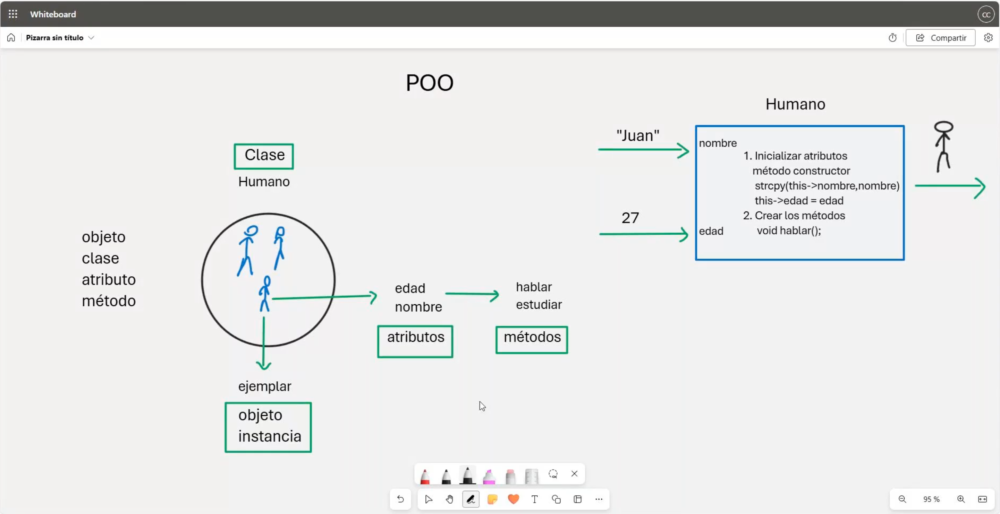
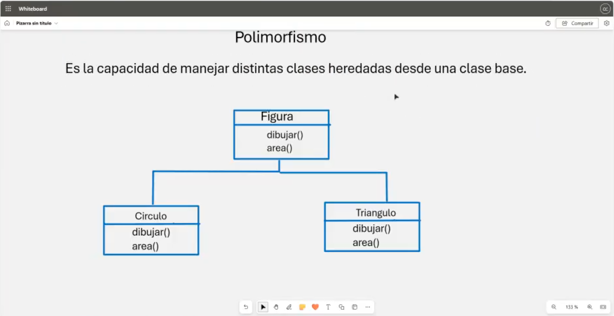

# 💻 Clase 16: Programación Orientada a Objetos (POO)

La **Programación Orientada a Objetos (POO)** es un paradigma de programación que organiza el código en torno a "objetos" que representan entidades del mundo real. Este enfoque facilita la reutilización, modularidad y extensibilidad del código.

---

## 📚 Contenido

### **1️⃣ Conceptos Clave de la POO**

1. **Clase:**
    - Es el molde o plantilla que define las propiedades (**atributos**) y comportamientos (**métodos**) de un objeto.
    - Ejemplo:
      ```cpp
      class Humano {
      private:
          string nombre;
          int edad;
      public:
          void saludar();
      };
      ```

2. **Objeto:**
    - Es una instancia de una clase.
    - Contiene valores específicos para los atributos definidos en la clase.
    - Ejemplo:
      ```cpp
      Humano humano1;
      humano1.saludar();
      ```

3. **Atributos:**
    - Son las propiedades o características que describen un objeto.
    - Ejemplo:
      ```cpp
      string nombre;
      int edad;
      ```

4. **Métodos:**
    - Son las funciones que definen el comportamiento del objeto.
    - Ejemplo:
      ```cpp
      void hablar();
      void estudiar();
      ```

---

### **2️⃣ Principios Fundamentales de la POO**

1. **Encapsulación:**
    - Agrupa los datos (**atributos**) y las operaciones (**métodos**) en una clase.
    - Protege los datos al hacerlos accesibles solo a través de métodos controlados.
    - Uso de modificadores de acceso como `private`, `protected` y `public`.

2. **Abstracción:**
    - Representa solo los detalles esenciales de un objeto, ocultando los detalles internos.
    - Ejemplo: Solo se accede a los métodos necesarios para interactuar con el objeto, como `saludar()`.

3. **Herencia:**
    - Permite que una clase (subclase) herede los atributos y métodos de otra clase (superclase).
    - Ejemplo:
      ```cpp
      class Estudiante : public Humano {
          string escuela;
      };
      ```

4. **Polimorfismo:**
    - Permite que un mismo método tenga diferentes comportamientos según el objeto que lo invoque.
    - Se logra mediante la sobrecarga de métodos o el uso de funciones virtuales.
    - Ejemplo:
      ```cpp
      void saludar(); // Implementación en cada clase.
      ```

---

### **3️⃣ Implementación de una Clase en C++**

Ejemplo de clase `Humano`:
```cpp
#include <iostream>
using namespace std;

class Humano {
private:
    string nombre; /**< Nombre del humano. */
    int edad;      /**< Edad del humano. */

public:
    // Constructor
    Humano(string nombre, int edad) {
        this->nombre = nombre;
        this->edad = edad;
    }

    // Método para saludar
    void saludar() const {
        cout << "Hola, soy " << nombre << " y tengo " << edad << " años." << endl;
    }

    // Getter para edad
    int getEdad() const {
        return edad;
    }

    // Setter para edad
    void setEdad(int nuevaEdad) {
        edad = nuevaEdad;
    }
};

int main() {
    Humano humano("Juan", 27); // Crear objeto
    humano.saludar();           // Llamar método saludar

    humano.setEdad(30);         // Modificar la edad
    cout << "Nueva edad: " << humano.getEdad() << endl;

    return 0;
}
```

---

### **4️⃣ Beneficios de la POO**

1. **Modularidad:** El código está organizado en clases, lo que facilita el mantenimiento y la comprensión.
2. **Reutilización:** Las clases pueden reutilizarse en otros proyectos o ampliarse mediante herencia.
3. **Facilidad de Mantenimiento:** Cambios en una clase no afectan directamente a otras partes del programa.
4. **Extensibilidad:** Es fácil agregar nuevas funcionalidades mediante nuevas clases o métodos.

---

## 🖼️ Capturas de Pantalla

1️⃣ **Diagrama de Clase y Objeto**


2️⃣ **Diagrama de Polimorfismo**


---

## 👨‍💻 Sobre el Autor
- **👤 Nombre:** Edwin Yoner
- **📧 Contacto:** [✉️ edwinyoner@gmail.com](mailto:edwinyoner@gmail.com)
- **🌐 LinkedIn:** [🌐 linkedin.com/in/edwinyoner](https://www.linkedin.com/in/edwinyoner)