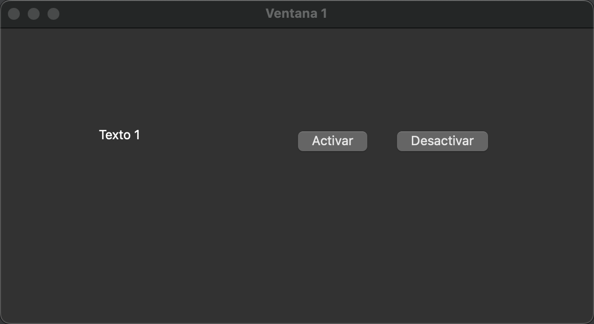
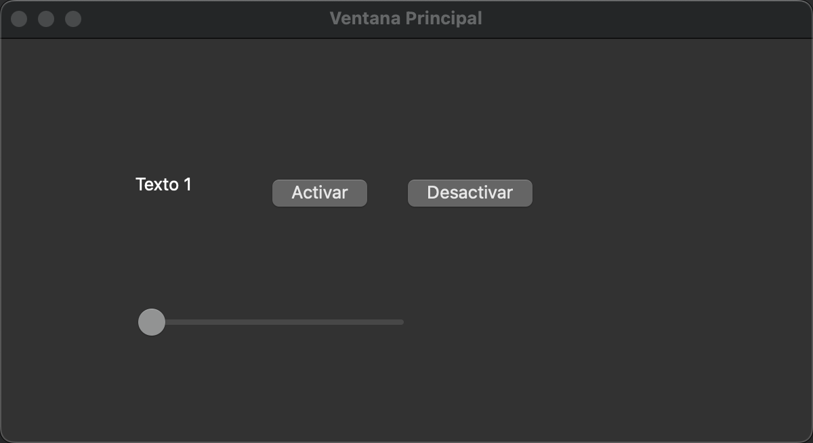
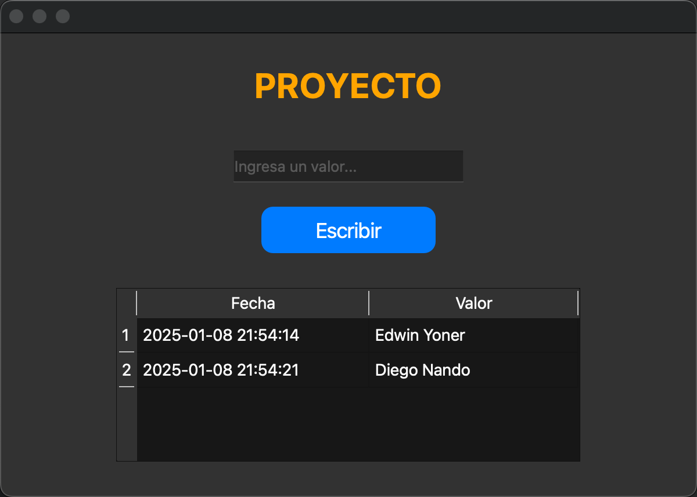

# 💻 Clase 21: Interfaz Gráfica con Qt

En esta clase exploramos el uso de **Qt** para la creación de interfaces gráficas de usuario (GUI). **Qt** es un framework multiplataforma utilizado para desarrollar aplicaciones con interfaces gráficas modernas y potentes.

---

## 📚 Contenido

### **1️⃣ Conceptos Clave de Qt**

1. **Interfaz Gráfica de Usuario (GUI):**
   - Permite a los usuarios interactuar visualmente con la aplicación mediante ventanas, botones, etiquetas, controles deslizantes, etc.

2. **Widgets:**
   - Elementos visuales de la interfaz, como botones, etiquetas, cuadros de texto y tablas.

3. **Señales y Slots:**
   - Mecanismo de Qt para la comunicación entre widgets.
   - Una señal se emite cuando ocurre un evento y un slot es una función que responde a esa señal.

---

### **2️⃣ Programas Realizados**

#### **Programa 1: Ventana con Botones**
- **Descripción:** Creación de una ventana con un texto y dos botones: "Activar" y "Desactivar".
- **Interfaz:**



- **Código:**
```cpp
#include <QApplication>
#include <QWidget>
#include <QPushButton>
#include <QLabel>

int main(int argc, char *argv[]) {
    QApplication app(argc, argv);
    QWidget ventana;
    ventana.setWindowTitle("Ventana 1");
    ventana.resize(400, 200);

    QLabel *label = new QLabel("Texto 1", &ventana);
    label->setGeometry(160, 50, 80, 30);

    QPushButton *btnActivar = new QPushButton("Activar", &ventana);
    btnActivar->setGeometry(120, 100, 80, 30);

    QPushButton *btnDesactivar = new QPushButton("Desactivar", &ventana);
    btnDesactivar->setGeometry(200, 100, 80, 30);

    ventana.show();
    return app.exec();
}
```

---

#### **Programa 2: Ventana con Barra Deslizante**
- **Descripción:** Creación de una ventana que incluye una barra deslizante y botones.
- **Interfaz:**



- **Código:**
```cpp
#include <QApplication>
#include <QWidget>
#include <QPushButton>
#include <QLabel>
#include <QSlider>

int main(int argc, char *argv[]) {
    QApplication app(argc, argv);
    QWidget ventana;
    ventana.setWindowTitle("Ventana Principal");
    ventana.resize(400, 300);

    QLabel *label = new QLabel("Texto 1", &ventana);
    label->setGeometry(160, 50, 80, 30);

    QPushButton *btnActivar = new QPushButton("Activar", &ventana);
    btnActivar->setGeometry(120, 100, 80, 30);

    QPushButton *btnDesactivar = new QPushButton("Desactivar", &ventana);
    btnDesactivar->setGeometry(200, 100, 80, 30);

    QSlider *slider = new QSlider(Qt::Horizontal, &ventana);
    slider->setGeometry(100, 200, 200, 30);

    ventana.show();
    return app.exec();
}
```

---

#### **Programa 3: Proyecto con Entrada de Datos y Tabla**
- **Descripción:** Creación de una ventana con un campo de entrada, un botón y una tabla que muestra los datos ingresados.
- **Interfaz:**



- **Código:**
```cpp
#include <QApplication>
#include <QWidget>
#include <QPushButton>
#include <QLineEdit>
#include <QLabel>
#include <QTableWidget>
#include <QTableWidgetItem>
#include <QDateTime>

int main(int argc, char *argv[]) {
    QApplication app(argc, argv);
    QWidget ventana;
    ventana.setWindowTitle("PROYECTO");
    ventana.resize(500, 400);

    QLabel *label = new QLabel("PROYECTO", &ventana);
    label->setGeometry(200, 20, 100, 30);
    label->setStyleSheet("font-size: 20px; font-weight: bold; color: orange;");

    QLineEdit *lineEdit = new QLineEdit(&ventana);
    lineEdit->setPlaceholderText("Ingresa un valor...");
    lineEdit->setGeometry(150, 80, 200, 30);

    QPushButton *btnEscribir = new QPushButton("Escribir", &ventana);
    btnEscribir->setGeometry(200, 130, 100, 40);
    btnEscribir->setStyleSheet("background-color: #007BFF; color: white;");

    QTableWidget *table = new QTableWidget(0, 2, &ventana);
    table->setGeometry(50, 200, 400, 150);
    table->setHorizontalHeaderLabels({"Fecha", "Valor"});

    QObject::connect(btnEscribir, &QPushButton::clicked, [&]() {
        int row = table->rowCount();
        table->insertRow(row);

        QDateTime now = QDateTime::currentDateTime();
        table->setItem(row, 0, new QTableWidgetItem(now.toString("yyyy-MM-dd HH:mm:ss")));
        table->setItem(row, 1, new QTableWidgetItem(lineEdit->text()));
        lineEdit->clear();
    });

    ventana.show();
    return app.exec();
}
```

---

### **3️⃣ Beneficios de Usar Qt**

- **Interfaz Profesional:** Qt permite crear aplicaciones gráficas modernas y personalizables.
- **Multiplataforma:** Las aplicaciones pueden ejecutarse en Windows, macOS y Linux.
- **Extensibilidad:** La estructura de señales y slots facilita la conexión entre widgets.

---

### **4️⃣ Requisitos**

- **Software:**
  - Qt Creator (IDE para desarrollar con Qt).
  - Bibliotecas de Qt.

---

### **5️⃣ Pasos para Ejecutar los Programas**

1. Abre Qt Creator y crea un nuevo proyecto de aplicación Qt Widgets.
2. Copia y pega el código en los archivos correspondientes.
3. Haz clic en "Compilar" y luego en "Ejecutar".
4. Observa cómo las ventanas y widgets interactúan de manera gráfica.

---

## 🖼️ Capturas de Pantalla

1️⃣ **Ventana 1:**


2️⃣ **Ventana Principal:**


3️⃣ **Proyecto:**


---

## 👨‍💻 Sobre el Autor

- **👤 Nombre:** Edwin Yoner
- **📧 Contacto:** [edwinyoner@gmail.com](mailto:edwinyoner@gmail.com)
- **🌐 LinkedIn:** [linkedin.com/in/edwinyoner](https://www.linkedin.com/in/edwinyoner)