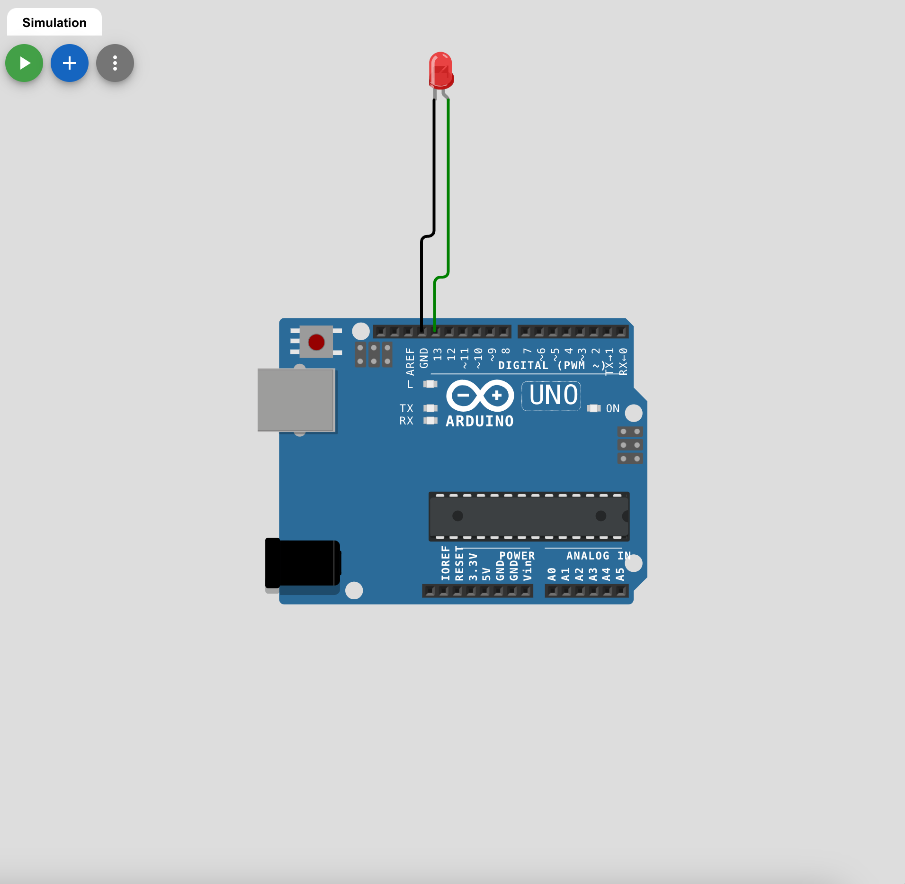
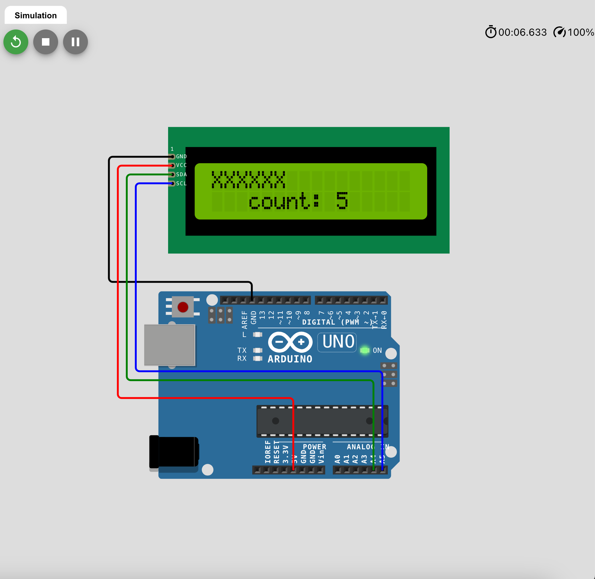

# 💻 Clase 22: Arduino

En esta clase exploramos el uso de **Arduino Uno** para realizar proyectos de electrónica, como el control de LEDs mediante programación y el manejo de pantallas LCD I2C. **Arduino** es una plataforma de hardware y software de código abierto utilizada para crear proyectos interactivos.

---

## 📚 Contenido

### **1️⃣ Conceptos Clave de Arduino**

1. **Placa Arduino Uno:**
   - Es una placa de microcontrolador basada en el ATmega328P con pines digitales y analógicos.
   - Tiene un LED integrado en el pin digital 13.

2. **IDE de Arduino:**
   - Entorno de desarrollo para escribir, compilar y cargar código en la placa Arduino.
   - Usa un lenguaje basado en C/C++.

3. **Componentes Electrónicos:**
   - **LED:** Diodo emisor de luz que se encenderá y apagará.
   - **Resistencia (opcional):** Evita que el LED reciba demasiada corriente y se queme.
   - **Pantalla LCD con módulo I2C:** Muestra mensajes de texto.

---

### **2️⃣ Estructura del Código en Arduino**

El programa de Arduino tiene dos funciones principales:

1. **`setup()`:**
   - Se ejecuta una vez al inicio.
   - Se utiliza para configurar los pines de entrada/salida y otros componentes.

2. **`loop()`:**
   - Se ejecuta de manera continua después de `setup()`.
   - Contiene el código que debe ejecutarse en bucle, como encender y apagar el LED.

---

### **3️⃣ Implementación 1: Código Blink LED**

Ejemplo de programa para hacer parpadear un LED en el pin 13:

```cpp
/**
 * @file blink_led.ino
 * @brief Programa para encender y apagar un LED en un intervalo de 1 segundo.
 * @author Edwin Yoner
 * @date 10/12/2024
 */

#define LED_PIN 13 /**< Pin al que está conectado el LED */

void setup() {
  pinMode(LED_PIN, OUTPUT); // Configura el pin como salida
}

void loop() {
  digitalWrite(LED_PIN, HIGH); // Enciende el LED
  delay(1000); // Espera 1 segundo (1000 ms)
  digitalWrite(LED_PIN, LOW);  // Apaga el LED
  delay(1000); // Espera 1 segundo antes de repetir el ciclo
}
```

**Montaje del Circuito:**
- Conecta el ánodo (pata larga) del LED al pin digital 13.
- Conecta el cátodo (pata corta) a GND.
- (Opcional) Coloca una resistencia de 220 ohms para proteger el LED.

---

### **4️⃣ Implementación 2: Uso de Pantalla LCD I2C**

Este ejemplo muestra cómo conectar y controlar una pantalla LCD I2C para mostrar texto dinámico.

**Conexiones:**
- `GND`: Tierra.
- `VCC`: Alimentación (5V).
- `SDA`: Pin A4 (datos).
- `SCL`: Pin A5 (reloj).

**Código:**
```cpp
#include <Wire.h>
#include <LiquidCrystal_I2C.h>

LiquidCrystal_I2C lcd(0x27, 16, 2); // Dirección I2C, 16 columnas y 2 filas.

void setup() {
  lcd.init(); // Inicializa la pantalla LCD.
  lcd.backlight(); // Activa la retroiluminación.
}

void loop() {
  for (int i = 0; i < 16; i++) {
    lcd.setCursor(i, 0);
    lcd.print("X"); // Imprime "X" en la fila superior.
    lcd.setCursor(2, 1);
    lcd.print("count: " + String(i)); // Muestra el conteo.
    delay(1000); // Espera 1 segundo.
  }
  lcd.clear(); // Limpia la pantalla al finalizar el conteo.
}
```

**Montaje del Circuito:**
- Conecta los pines SDA y SCL del módulo I2C a los pines A4 y A5 del Arduino respectivamente.
- Alimenta la pantalla LCD con `VCC` (5V) y `GND`.

---

## 🖼️ Capturas de Pantalla

1️⃣ **Control de LED en Arduino**


2️⃣ **Pantalla LCD I2C mostrando texto dinámico**


---

## 👨‍💻 Sobre el Autor

- **👤 Nombre:** Edwin Yoner
- **📧 Contacto:** [edwinyoner@gmail.com](mailto:edwinyoner@gmail.com)
- **🌐 LinkedIn:** [linkedin.com/in/edwinyoner](https://www.linkedin.com/in/edwinyoner)