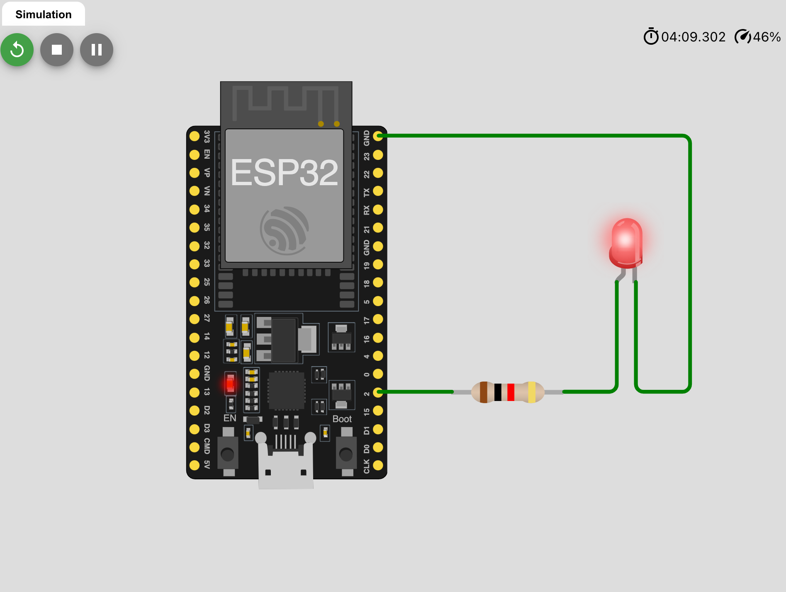
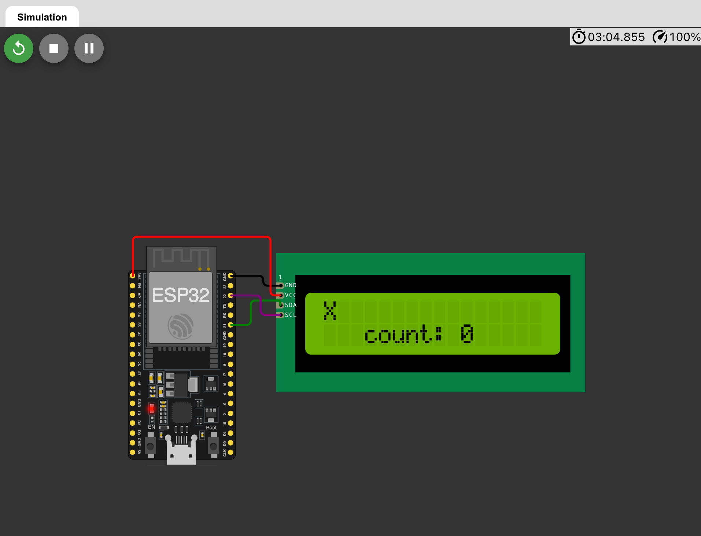

# 💻 Clase 23: ESP32

El **ESP32** es un microcontrolador de alto rendimiento y bajo costo que incluye conectividad WiFi y Bluetooth. Es ideal para proyectos de IoT, automatización y sistemas embebidos. A continuación, se detallan ejemplos y conexiones comunes para manejar LEDs y pantallas LCD con el ESP32.

---

## 📚 Contenido

### **1️⃣ ¿Qué es el ESP32?**

El **ESP32** es un chip de doble núcleo que soporta múltiples protocolos de comunicación. Sus características principales son:
- Procesador de 32 bits con velocidad de hasta 240 MHz.
- WiFi y Bluetooth incorporados.
- Amplia cantidad de pines de entrada y salida (GPIO).

---

### **2️⃣ Control de LED con ESP32**

Este ejemplo muestra cómo encender y apagar un LED conectado al pin GPIO 2 usando la biblioteca **FreeRTOS**.

#### **Código:**

```cpp
/**
 * @file led_esp32.c
 * @brief Control de LED con ESP32 utilizando FreeRTOS.
 * @author Edwin Yoner
 * @date 12/12/2024
 */

#include <stdio.h>
#include "freertos/FreeRTOS.h"
#include "freertos/task.h"
#include "driver/gpio.h"

void app_main() {
  gpio_set_direction(GPIO_NUM_2, GPIO_MODE_OUTPUT); // Configuración del pin GPIO 2 como salida

  while (1) {
    gpio_set_level(GPIO_NUM_2, 1);  // Enciende el LED
    vTaskDelay(1000 / portTICK_PERIOD_MS);  // Espera 1 segundo
    gpio_set_level(GPIO_NUM_2, 0);  // Apaga el LED
    vTaskDelay(1000 / portTICK_PERIOD_MS);  // Espera 1 segundo
  }
}
```

---

### **3️⃣ Pantalla LCD I2C con ESP32**

El siguiente ejemplo muestra cómo conectar y utilizar una pantalla LCD con comunicación I2C.

#### **Conexión de la Pantalla LCD:**

| Pin LCD I2C | Pin ESP32 |
|-------------|-----------|
| **VCC**     | **3.3V**  |
| **GND**     | **GND**   |
| **SDA**     | **GPIO 21** |
| **SCL**     | **GPIO 22** |

---

#### **Código:**

```cpp
/**
 * @file lcd_display_esp32.ino
 * @brief Programa para mostrar texto en una pantalla LCD con ESP32.
 * @author Edwin Yoner
 * @date 12/12/2024
 */

#include <Wire.h>               // Biblioteca para comunicación I2C
#include <LiquidCrystal_I2C.h>  // Biblioteca para manejar pantallas LCD I2C

#define SDA_PIN 21 // Pin SDA del ESP32
#define SCL_PIN 22 // Pin SCL del ESP32

LiquidCrystal_I2C LCD(0x27, 16, 2); // Dirección I2C del LCD (0x27), 16 columnas y 2 filas
char msg[20]; // Cadena para almacenar el mensaje

void setup() {
  Wire.begin(SDA_PIN, SCL_PIN);  // Inicializa la comunicación I2C
  LCD.init();                   // Inicializa la pantalla LCD
  LCD.backlight();              // Enciende la retroiluminación
}

void loop() {
  for (int i = 0; i < 16; i++) {  // Recorre las 16 posiciones de la primera fila
    LCD.setCursor(i, 0);         // Mueve el cursor a la posición actual
    LCD.print("X");              // Imprime el carácter "X"

    LCD.setCursor(2, 1);         // Mueve el cursor a la tercera posición de la segunda fila
    snprintf(msg, 20, " count: %d", i);  // Formatea el mensaje con el contador
    LCD.print(msg);              // Imprime el mensaje
    delay(1000);  // Espera 1 segundo
  }
  LCD.clear();  // Limpia la pantalla
}
```

---

### **4️⃣ Explicación de la Conexión del LED:**

| Pin del LED | Pin ESP32 |
|-------------|-----------|
| **Ánodo (+)** | **GPIO 2** |
| **Cátodo (-)** | **GND** |

La resistencia se coloca en serie con el LED para limitar la corriente.

---

### **5️⃣ Capturas de Pantalla**

1️⃣ **Control de LED:**



2️⃣ **Pantalla LCD I2C:**



---

## 👨‍💻 Sobre el Autor

- **👤 Nombre:** Edwin Yoner
- **📧 Contacto:** [✉️ edwinyoner@gmail.com](mailto\:edwinyoner@gmail.com)
- **🌐 LinkedIn:** [🌐 linkedin.com/in/edwinyoner](https://www.linkedin.com/in/edwinyoner)