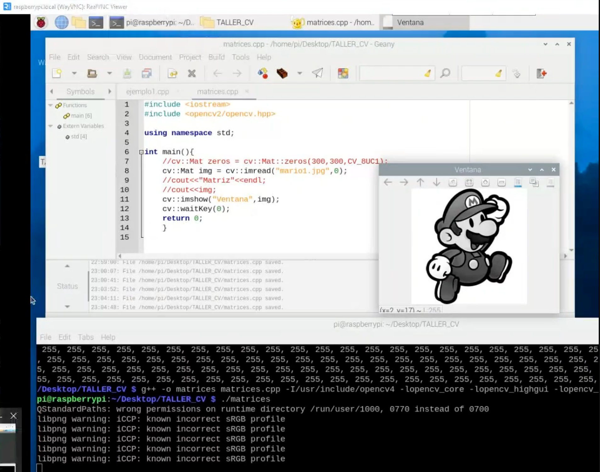

# 💻 Clase: Procesamiento de Imágenes en Raspberry Pi con OpenCV

En esta clase exploramos el uso de **OpenCV** en **C++** para cargar y mostrar imágenes en un entorno **Raspberry Pi**. OpenCV es una biblioteca de visión por computadora de código abierto utilizada para procesar y analizar imágenes y videos, y **Raspberry Pi** es una plataforma ideal para proyectos de visión debido a su portabilidad y flexibilidad.

---

## 📚 Contenido

### **1️⃣ Conceptos Clave de OpenCV**

1. **cv::Mat:**

   - Clase principal utilizada para manejar imágenes y videos en OpenCV.
   - Permite almacenar imágenes en diferentes formatos (grayscale, BGR, etc.).

2. **Función `cv::imread()`:**

   - Carga una imagen desde un archivo.
   - Permite especificar si la imagen debe cargarse en escala de grises o en color.

3. **Función `cv::imshow()`:**

   - Muestra la imagen en una ventana gráfica.

4. **Función `cv::waitKey()`:**

   - Pausa la ejecución del programa hasta que el usuario presione una tecla.

---

### **2️⃣ Implementación: Cargar y Mostrar una Imagen**

Este ejemplo muestra cómo leer y mostrar una imagen con OpenCV en **C++** ejecutado en **Raspberry Pi**.

```cpp
/**
 * @file mostrar_imagen.cpp
 * @brief Programa para cargar y mostrar una imagen en OpenCV utilizando Raspberry Pi.
 * @author Edwin Yoner
 * @date 14/12/2024
 */

#include <iostream>  /**< Biblioteca estándar de C++ para entrada y salida */
#include <opencv2/opencv.hpp> /**< Biblioteca OpenCV para procesamiento de imágenes */

using namespace std; /**< Espacio de nombres estándar */

int main() {
    // Crear una imagen de 300x300 píxeles con valores de cero (imagen negra)
    cv::Mat zeros = cv::Mat::zeros(300, 300, CV_8UC1); /**< Imagen negra de 8 bits en escala de grises */

    // Leer una imagen desde el archivo "mario1.jpg" en escala de grises
    cv::Mat img = cv::imread("mario1.jpg", 0); /**< Carga la imagen en escala de grises */

    // Verificar si la imagen se cargó correctamente
    if (img.empty()) {
        cerr << "Error: No se pudo cargar la imagen." << endl;
        return -1; /**< Salida con error si la imagen no se carga */
    }

    // Mostrar la imagen en una ventana
    cv::imshow("Ventana", img); /**< Muestra la imagen en una ventana llamada "Ventana" */

    // Esperar a que el usuario presione una tecla para cerrar la ventana
    cv::waitKey(0); /**< Espera indefinidamente hasta que se presione una tecla */

    return 0; /**< Retorna 0 para indicar una ejecución exitosa */
}
```

---

### **3️⃣ Explicación del Código**

1. **`cv::Mat::zeros()`:**

   - Crea una imagen negra de 300x300 píxeles en escala de grises.
   - `CV_8UC1` significa 8 bits por canal y 1 canal (escala de grises).

2. **`cv::imread()`:**

   - Carga la imagen `mario1.jpg` en escala de grises.
   - El parámetro `0` indica que se carga en modo de escala de grises.

3. **`cv::imshow()`:**

   - Muestra la imagen cargada en una ventana con el nombre "Ventana".

4. **`cv::waitKey()`:**

   - Pausa la ejecución hasta que el usuario presione una tecla.

---

### **4️⃣ Beneficios del Proyecto**

- **Introducción al procesamiento de imágenes:** Aprende a cargar y visualizar imágenes en C++.
- **Práctica con OpenCV:** Familiarízate con las funciones básicas de esta poderosa biblioteca.
- **Integración con Raspberry Pi:** Aprende a realizar tareas de visión por computadora en un entorno embebido.

---

### **5️⃣ Requisitos**

### **Software:**

- OpenCV instalado en **Raspberry Pi** ([Guía de Instalación](https://opencv.org/)).
- IDE o editor compatible con C++ (como **VS Code** o terminal con **GCC**).

### **Hardware:**

- Raspberry Pi (con sistema operativo Raspbian).
- Imagen `mario1.jpg` cargada en el sistema.

---

### **6️⃣ Ejecución del Programa**

1. Asegúrate de que OpenCV esté instalado en tu Raspberry Pi.
2. Compila el programa con el siguiente comando:
   ```bash
   g++ mostrar_imagen.cpp -o mostrar_imagen `pkg-config --cflags --libs opencv4`
   ```
3. Ejecuta el programa con:
   ```bash
   ./mostrar_imagen
   ```
4. Se abrirá una ventana mostrando la imagen cargada.

---

### **7️⃣ Capturas de Pantalla**

1️⃣ **Visualización de la Imagen:**


2️⃣ **Entorno de ejecución del programa:**



---

## 👨‍💻 Sobre el Autor

- **👤 Nombre:** Edwin Yoner
- **📧 Contacto:** [edwinyoner@gmail.com](mailto:edwinyoner@gmail.com)
- **🌐 LinkedIn:** [linkedin.com/in/edwinyoner](https://www.linkedin.com/in/edwinyoner)