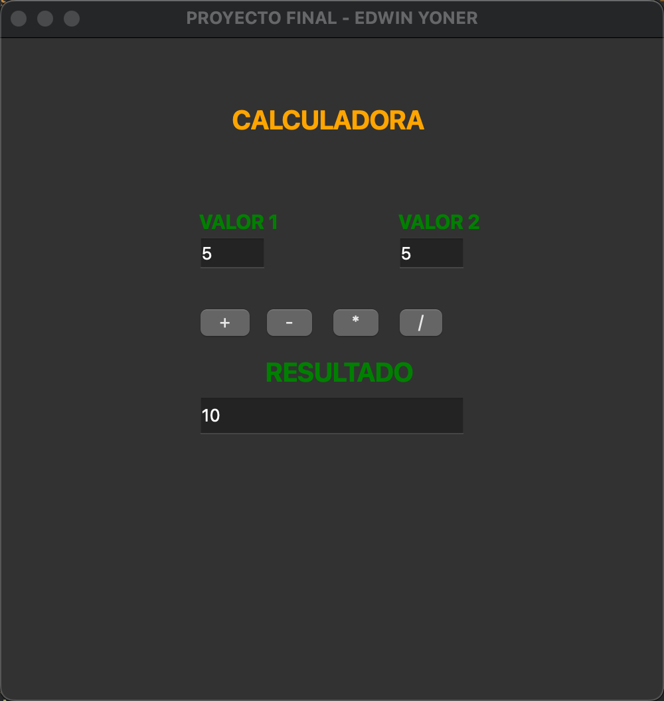

# 💻 Proyecto Final: Calculadora en Qt

Este proyecto es una **calculadora gráfica** creada con **Qt** utilizando `QLabel`, `QLineEdit` y `QPushButton` para realizar operaciones matemáticas básicas (suma, resta, multiplicación y división).

---

## 📚 Contenido

### **1️⃣ Estructura del Proyecto**

#### **Archivos del Proyecto:**

- `main.cpp`: Archivo principal que ejecuta la aplicación.
- `widget.h`: Archivo de cabecera que contiene la declaración de la clase `Widget`.
- `widget.cpp`: Implementación de la clase `Widget`, que define la interfaz y las funciones de la calculadora.

---

### **2️⃣ Diseño de la Calculadora**

La interfaz gráfica de la calculadora cuenta con los siguientes elementos:

1. **Etiqueta de título:** "CALCULADORA".
2. **Etiquetas de entrada:** "VALOR 1" y "VALOR 2".
3. **Campos de texto (`QLineEdit`):** Dos campos para ingresar los valores numéricos.
4. **Botones (`QPushButton`):** Botones para sumar, restar, multiplicar y dividir.
5. **Etiqueta y campo de resultado:** Muestra el resultado de la operación.



---

### **3️⃣ Código del Proyecto**

#### **`main.cpp`**
```cpp
#include "widget.h"
#include <QApplication>

int main(int argc, char *argv[])
{
    QApplication a(argc, argv);
    Widget w;
    w.show();
    return a.exec();
}
```

#### **`widget.h`**
```cpp
#ifndef WIDGET_H
#define WIDGET_H

#include <QWidget>
#include <QString>
#include <QLabel>
#include <QLineEdit>
#include <QPushButton>
#include <QMessageBox>

class Widget : public QWidget
{
    Q_OBJECT

private:
    const int WINDOW_WIDTH = 500;
    const int WINDOW_HEIGHT = 500;
    const int WINDOW_X = 750;
    const int WINDOW_Y = 250;

    QString titulo;
    QLabel *labelNombreProyecto;
    QLabel *labelCampo1;
    QLabel *labelCampo2;
    QLabel *labelResultado;
    QLineEdit *campo1;
    QLineEdit *campo2;
    QLineEdit *campoResultado;
    QPushButton *botonSumar;
    QPushButton *botonRestar;
    QPushButton *botonMultiplicar;
    QPushButton *botonDividir;

public:
    Widget(QWidget *parent = nullptr);
    ~Widget();

private:
    void initUI();

private slots:
    void sumar();
    void restar();
    void multiplicar();
    void dividir();
};

#endif // WIDGET_H
```

#### **`widget.cpp`**
```cpp
#include "widget.h"

Widget::Widget(QWidget *parent)
    : QWidget(parent), titulo("PROYECTO FINAL - EDWIN YONER")
{
    initUI();
}

Widget::~Widget() {}

void Widget::initUI() {
    setGeometry(WINDOW_X, WINDOW_Y, WINDOW_WIDTH, WINDOW_HEIGHT);
    setWindowTitle(titulo);

    // Etiqueta de título
    labelNombreProyecto = new QLabel("CALCULADORA", this);
    labelNombreProyecto->setStyleSheet("font-size: 20px; font-weight: bold; color: orange;");
    labelNombreProyecto->move((WINDOW_WIDTH - labelNombreProyecto->width()) / 2, 50);

    // Etiquetas de los valores
    labelCampo1 = new QLabel("VALOR 1", this);
    labelCampo1->setStyleSheet("font-size: 15px; font-weight: bold; color: green;");
    labelCampo1->move(150, 130);

    labelCampo2 = new QLabel("VALOR 2", this);
    labelCampo2->setStyleSheet("font-size: 15px; font-weight: bold; color: green;");
    labelCampo2->move(300, 130);

    labelResultado = new QLabel("RESULTADO", this);
    labelResultado->setStyleSheet("font-size: 20px; font-weight: bold; color: green;");
    labelResultado->move(200, 240);

    // Campos de entrada
    campo1 = new QLineEdit(this);
    campo2 = new QLineEdit(this);
    campo1->setGeometry(150, 150, 50, 25);
    campo2->setGeometry(300, 150, 50, 25);

    // Campo de resultado
    campoResultado = new QLineEdit(this);
    campoResultado->setGeometry(150, 270, 200, 30);
    campoResultado->setReadOnly(true);

    // Botones de operación
    botonSumar = new QPushButton("+", this);
    botonSumar->move(150, 200);
    connect(botonSumar, &QPushButton::clicked, this, &Widget::sumar);

    botonRestar = new QPushButton("-", this);
    botonRestar->move(200, 200);
    connect(botonRestar, &QPushButton::clicked, this, &Widget::restar);

    botonMultiplicar = new QPushButton("*", this);
    botonMultiplicar->move(250, 200);
    connect(botonMultiplicar, &QPushButton::clicked, this, &Widget::multiplicar);

    botonDividir = new QPushButton("/", this);
    botonDividir->move(300, 200);
    connect(botonDividir, &QPushButton::clicked, this, &Widget::dividir);
}

void Widget::sumar() {
    int num1 = campo1->text().toInt();
    int num2 = campo2->text().toInt();
    int resultado = num1 + num2;
    campoResultado->setText(QString::number(resultado));
}

void Widget::restar() {
    int num1 = campo1->text().toInt();
    int num2 = campo2->text().toInt();
    int resultado = num1 - num2;
    campoResultado->setText(QString::number(resultado));
}

void Widget::multiplicar() {
    int num1 = campo1->text().toInt();
    int num2 = campo2->text().toInt();
    int resultado = num1 * num2;
    campoResultado->setText(QString::number(resultado));
}

void Widget::dividir() {
    int num1 = campo1->text().toInt();
    int num2 = campo2->text().toInt();
    if (num2 == 0) {
        QMessageBox::warning(this, "Error", "No se puede dividir entre 0");
        campoResultado->clear();
    } else {
        double resultado = static_cast<double>(num1) / num2;
        campoResultado->setText(QString::number(resultado));
    }
}
```

---

### **4️⃣ Explicación del Código**

- **Etiquetas (`QLabel`):** Se utilizan para mostrar textos descriptivos en la interfaz.
- **Campos de entrada y resultado (`QLineEdit`):** Permiten ingresar valores y mostrar el resultado.
- **Botones (`QPushButton`):** Ejecutan las operaciones matemáticas al ser presionados.
- **Mensajes de error:** Si se intenta dividir por cero, se muestra un mensaje de advertencia mediante `QMessageBox`.

---

### **5️⃣ Requisitos**

- **Framework Qt**.
- **Qt Creator**.

---

### **6️⃣ Pasos para Ejecutar el Proyecto**

1. Abre el proyecto en **Qt Creator** o tu entorno preferido.
2. Compila el proyecto.
3. Ejecuta el archivo resultante.
4. Ingresa los valores en "VALOR 1" y "VALOR 2".
5. Presiona uno de los botones de operación para ver el resultado.

---

## 👨‍💻 Sobre el Autor

- **👤 Nombre:** Edwin Yoner
- **📧 Contacto:** [edwinyoner@gmail.com](mailto:edwinyoner@gmail.com)
- **🌐 LinkedIn:** [linkedin.com/in/edwinyoner](https://www.linkedin.com/in/edwinyoner)